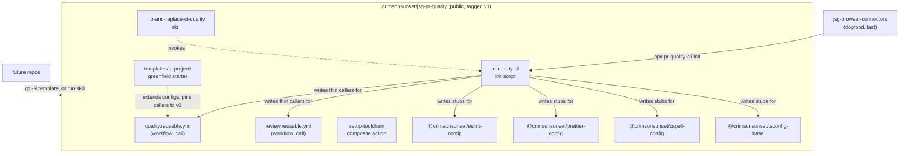

# PR Quality Hub Plan

**Status:** Phases 1–5 built and merged; `v1` tagged. Packages at `0.1.7` (hardening, unicorn pin fix, knip/scripts + CLI dep cleanup). Phase 6 dogfood retargeted to `karakeep-instagram-relay` (hardening Decision #1): local adopt + `ci:lint`/`ci:test` green; consumer PR deferred.
**Last updated:** Aug 11, 2026
**Scope:** Turn the PR quality flow already proven in `jsg-browser-connectors` (Phases 1–5 of its own plan) into a reusable `crimsonsunset/jsg-pr-quality` hub: a `workflow_call` reusable workflow for CI orchestration, a set of shareable `@crimsonsunset/*` npm config packages for baseline lint/format/type rules, a CLI init script that writes all of it into a target repo, an in-repo template folder for greenfield bootstrap, and a Cursor skill that walks an agent through retrofitting an existing repo onto all of it.
**Related:** [PR Quality Flow Plan](https://github.com/crimsonsunset/jsg-browser-connectors/blob/feature/pr-quality-flow/docs/planning/pr-quality-flow-plan.md) (the in-repo build this hub extracts from — see its Phase 6)

---

## TL;DR

`jsg-browser-connectors` already runs the full flow: deterministic gates via an orchestrator script, a sticky PR comment, Semgrep/gitleaks/audit, and PR-Agent for AI review. That repo is the reference implementation, not a throwaway. This plan copies its working pieces out into a public hub other repos can point at.

Several things get built, not one, because the user wants all of it: a `workflow_call` hub for the CI plumbing, `@crimsonsunset/eslint-config` / `prettier-config` / `cspell-config` / `tsconfig-base` npm packages so "baseline lint and other quality rails" travel with the hub instead of being copy-pasted, and a `templates/ts-project/` folder for starting something new. A Cursor skill named `rip-and-replace-ci-quality` exists because dropping a README on someone doesn't retrofit an existing repo; an agent needs a repeatable procedure for tearing out ad-hoc lint/CI config and wiring in the shared one.

The skill doesn't hand-write every file itself, though. A `packages/cli` init script (`@crimsonsunset/pr-quality-cli`) does the mechanical part — writing config stubs, adding devDeps, writing the caller workflow YAML — deterministically and idempotently. The skill's job shrinks to what actually needs judgment: detecting what's already there, deciding what to remove, resolving repo-specific conflicts, then calling the script for the boilerplate. Scripted file writes are testable in isolation; an agent free-handing the same edits via its own judgment every single time is slower and more error-prone for pure boilerplate.

Dogfood runs **last** (Phase 6). Hardening Decision #1 retargeted it to `karakeep-instagram-relay` (plain-JS Node service) so the hardened lint defaults get a real defect-class workout; `jsg-browser-connectors` stays a later thin-caller migration. The skill has been exercised on karakeep's empty quality stack; a messier teardown target remains useful later.

---

## Overview

**What this is:** A public `crimsonsunset/jsg-pr-quality` repo hosting a reusable CI workflow, four shareable config packages, a CLI init script, a greenfield template folder, and an adoption skill — all in one repo.

**What this is NOT:**

- **Not a redesign of the flow itself** — the gate set (ESLint, `tsc`, build, Knip, cspell, Semgrep, gitleaks, `npm audit`, PR-Agent) and the sticky-report pattern are already decided and working in `jsg-browser-connectors`. This plan extracts and parameterizes, it doesn't re-litigate.
- **Not a codemod that rewrites application logic** — the CLI script only ever touches config files, `package.json` scripts/devDeps, and `.github/workflows/*.yml`. It never touches `shared/`, `sites/`, or any repo's actual source.
- **Not a full-fleet migration** — only `jsg-browser-connectors` moves onto the hub in this plan. Every other personal repo adopts later, on demand, by running the skill.
- ~~**Not a shared `knip.json`**~~ / ~~**Not test/coverage tooling**~~ — **Reversed** in [quality-capability-hardening-plan.md](./quality-capability-hardening-plan.md) (Decisions #7–#8). Knip now ships `@crimsonsunset/knip-config` + CLI-derived `entry` via `knip.config.js`; tests ship as a default-on `ci:test` job with a "none found" state when no suite exists.
- **Not a monorepo/Turbo adoption** — same reasoning as the source plan: full-repo checks are fast enough that changed-file scoping is overhead, not a fix.
- **Not new AI-review prompt content** — `.pr_agent.toml` and `review-standards.md` stay per-repo (conventions differ per repo); the hub only wraps the workflow that invokes PR-Agent.

**Dependency chain:**

```
Phase 1: reusable workflows + setup-toolchain composite action (self-tested against this repo)
  ↓
Phase 2: @crimsonsunset/* config packages (npm workspaces, published)
  ↓
Phase 3: pr-quality-cli init script (writes packages + workflows into a target repo)
  ↓
Phase 4: templates/ts-project/ folder — greenfield path
  ↓
Phase 5: rip-and-replace-ci-quality skill, authored in-repo
  ↓
Phase 6: dogfood — retargeted to karakeep-instagram-relay (hardening Decision #1); jsg-browser-connectors remains a later caller
```

---

## Decisions

| #   | Decision                                                                                                                     | Rationale                                                                                                                                                                                                          |
| --- | ----------------------------------------------------------------------------------------------------------------------------- | -------------------------------------------------------------------------------------------------------------------------------------------------------------------------------------------------------------- |
| 1   | Extract now, from a working reference (`jsg-browser-connectors`), instead of designing the hub abstraction from scratch      | Mirrors the source plan's own Decision #3 — build it once, deliberately, then generalize. The shape is already proven; guessing at parameters up front risks over-engineering.                                   |
| 2   | Reusable workflow takes a `package-manager` input (`npm` \| `pnpm`), not npm-only                                             | `set-times-app` and `jsg-tech-check-site` are already on pnpm (`pnpm@10.30.2`, `pnpm@10.13.1`). An npm-only hub can't onboard them without a package-manager migration first, which is out of scope.              |
| 3   | Repo-specific check ownership (`scripts/ci/lint.script.mjs`, `ci:lint`) stays in each consumer repo; the hub only owns generic plumbing (checkout/setup/install/security scans/sticky report) | Carries forward the source plan's Decision #6. Keeps the hub from accumulating per-repo `if` branches as more repos adopt it.                                                                                     |
| 4   | Build `@crimsonsunset/eslint-config`, `prettier-config`, `cspell-config`, `tsconfig-base` as npm workspaces inside this same repo | User explicitly asked for "baseline lint and other quality rails" to come along for the ride. One repo versioning hub + configs together avoids coordinating releases across two repos for every change.        |
| 5   | Config packages publish to npm as public scoped packages (`npm publish --access public`)                                     | First publish under an unused scope (`@crimsonsunset`) defaults to private, which requires a paid npm plan. `--access public` keeps it free and matches the hub's own public visibility.                         |
| 6   | Config packages are thin, extendable exports — each repo keeps its own `eslint.config.mjs`/`tsconfig.json` that imports the shared base and layers repo-specific overrides on top | `jsg-browser-connectors` already needs its own overrides (alias-only imports, OpenCLI globals for bundled plugins). A single opaque "extends and you can't touch it" config would force a fork on day one.       |
| 7   | Ship the greenfield starter as a `templates/ts-project/` folder in this repo, not a separate `crimsonsunset/ts-project-template` GitHub template repo | User: "no new repo just put it here in a folder." A folder versions with the hub, so a workflow input change and the template that uses it move in one commit — a separate repo would need its own release coordination for every hub change. Cost is losing GitHub's "Use this template" button; `cp -R` covers it. |
| 8   | Write a Cursor skill, `rip-and-replace-ci-quality`, authored in this repo and symlinked into `~/.cursor/skills/`               | Explicit user ask. Existing repos have ad-hoc lint/CI config that needs systematic removal (old devDeps, old config files, old workflow YAML), not just a README to read. Living in-repo keeps it versioned alongside the CLI it drives. |
| 9   | `jsg-browser-connectors` is the hub's dogfood, and it runs **last**, after everything else is built                            | Dogfooding proves the reusable workflow produces the same sticky report/reviewdog/PR-Agent behavior it's replacing, on the repo with real PR history to compare against. Running it last means the CLI, template, and skill are all available to exercise during the migration rather than being written afterward. |
| 10  | Tag the hub `v1`; every caller pins to the tag, never `@main`                                                                 | Same supply-chain logic already applied to third-party actions in `jsg-browser-connectors` (pinned to SHAs). Once other repos depend on this hub, an unpinned `@main` caller is exactly the risk that was just fixed elsewhere. |
| 11  | Add a `packages/cli` init script (`@crimsonsunset/pr-quality-cli`) that writes config stubs, devDeps, and caller workflow YAML into a target repo; the skill calls it instead of hand-writing those files itself | User asked for "a script that moves things into place." Deterministic file writes are testable and idempotent on their own; leaving pure boilerplate to an agent's per-run judgment is slower and more error-prone than it needs to be. |
| 12  | The CLI is additive-only by default (skips files that already exist, `--force` to overwrite) and never touches application source, only config/`package.json`/`.github/workflows/*.yml` | Removing old, conflicting config is a judgment call (does this repo's ESLint override matter, is this workflow file safe to replace) — that stays with the skill, not the script, so the script can't destroy something it doesn't understand. |
| 13  | Publish via npm Trusted Publishing (OIDC) on a `v*.*.*` tag push, with no `NPM_TOKEN` in repo secrets                          | Matches the pattern already working in `jsg-logger`. A long-lived publish token in a public repo's secrets is the exact supply-chain exposure the SHA-pinning work was avoiding elsewhere. Cost: the first release of each package must be pushed by hand, because a Trusted Publisher can only be attached to a package that already exists. |
| 14  | `publish.yml` runs `npm publish --workspaces --access public` rather than iterating an explicit package list                    | The workspace globs in `package.json` are already the source of truth for what exists; a second hardcoded list in a publish script is pure drift risk. `--workspaces` skips private packages on its own. |
| 15  | Every caller workflow declares `permissions` explicitly, and the CLI/template write that block                                 | A called workflow can only *narrow* the caller's `GITHUB_TOKEN`, never widen it. A caller with no `permissions` block inherits the repo default (contents-only on most repos) and the run dies at startup before any job exists. Found by the hub's own first self-test run. |

---

## Scope

### In scope

**Hub workflows** (`crimsonsunset/jsg-pr-quality`)

- `.github/workflows/quality.reusable.yml` — `workflow_call` version of `jsg-browser-connectors`' `quality.on-pr.yml` (audit/quality/semgrep/gitleaks/report jobs), parameterized
- `.github/workflows/review.reusable.yml` — `workflow_call` version of `review.on-pr.yml` (PR-Agent), with `secrets` passthrough for `OPENROUTER__KEY`
- `.github/actions/setup-toolchain/action.yml` — composite action: `setup-node` + conditional `pnpm/action-setup`, install command branches on `package-manager` input
- `.github/workflows/self-test.on-pr.yml` — calls the two reusable workflows above against this repo itself
- Inputs: `node-version`, `package-manager`, `lint-script` (name of the caller's orchestrator npm script), `run-audit`/`run-semgrep`/`run-gitleaks` toggles

**Config packages** (npm workspaces, same repo)

- `packages/eslint-config` → `@crimsonsunset/eslint-config`
- `packages/prettier-config` → `@crimsonsunset/prettier-config`
- `packages/cspell-config` → `@crimsonsunset/cspell-config`
- `packages/tsconfig-base` → `@crimsonsunset/tsconfig-base`
- Published publicly to npm

**CLI init script**

- `packages/cli` → `@crimsonsunset/pr-quality-cli`, exposing a `pr-quality` bin with an `init` command
- Detects package manager from the lockfile, adds the four config packages as devDeps, writes config-file stubs and thin caller workflow YAML, adds missing npm scripts
- Additive by default (skips existing files), `--force` to overwrite, `--dry-run` to preview
- Idempotent — safe to re-run when the hub or config packages ship a new version

**Publishing**

- `.github/workflows/publish.yml` — OIDC trusted publishing on `v*.*.*` tag push, `npm publish --workspaces --access public`
- Bare Actions tags (`v1`) deliberately excluded from the tag filter so consumer-pin retags don't trigger npm releases

**Greenfield template**

- `templates/ts-project/` folder in this repo: starter `package.json`, config files extending the shared packages, thin caller workflows pinned to `v1`, bootstrap README
- Adopted by `cp -R`, not GitHub's template button

**Adoption skill**

- `skills/rip-and-replace-ci-quality/SKILL.md` authored in this repo, symlinked into `~/.cursor/skills/rip-and-replace-ci-quality/` (same convention as `project-cursor-rules-central`)
- Detects existing setup and decides what to remove, then calls `pr-quality-cli init` for the mechanical writes — it doesn't hand-edit config files itself

**Dogfood (last)**

- `jsg-browser-connectors`' two workflow files rewritten as thin callers pinned to `jsg-pr-quality@v1`
- `jsg-browser-connectors`' `eslint.config.mjs`/`.prettierrc`/`cspell.json`/`tsconfig.json` rewritten to import/extend the four shared packages

### Out of scope

- **Migrating every personal repo onto the hub** — only `jsg-browser-connectors` moves in this plan; the rest adopt later, on demand, via the skill
- **Proving the skill on a second, untouched repo** — deferred. The skill ships authored but unexercised; the dogfood is agent-guided on a repo whose setup is already known, which validates the hub and CLI but not the skill's teardown judgment
- **A separate GitHub template repo** — superseded by the in-repo `templates/ts-project/` folder (Decision #7)
- **A shared Knip config package** — Knip's entry-point config is inherently repo-specific (dynamically-loaded adapters, CLI mains); forcing it into a shared package would just reintroduce the noise problem the source plan already solved per-repo
- **Test/coverage gates in the hub** — `set-times-app`'s test job stays local; no test runner is being standardized
- **Monorepo/Turbo-aware scoping in the hub** — full-repo checks are fast enough across the target repos that changed-file scoping isn't solving a real problem yet
- **New AI-review prompt content** — `.pr_agent.toml` and `review-standards.md` stay per-repo; the hub only supplies the `workflow_call` wrapper around PR-Agent
- **Private-repo-specific handling** — the hub is public, which means both public and private callers can use it (public reusable workflows are callable from anywhere); nothing private-only is being solved

---

## Architecture



### Check ownership

| Layer                                                        | Owner                                                             | Why                                          |
| -------------------------------------------------------------- | ------------------------------------------------------------------ | --------------------------------------------- |
| Which checks exist, what they run                              | `scripts/ci/lint.script.mjs` (per repo)                            | Repo-specific; hub stays generic (Decision #3) |
| Node/pnpm setup, install, cache, security scans, sticky report  | `jsg-pr-quality` reusable workflows + `setup-toolchain`             | Identical across repos                        |
| Baseline lint/format/type rules                                | `@crimsonsunset/*` config packages                                 | Shared, versioned, extendable (Decision #6)   |
| Model, prompt, review standards                                | `.pr_agent.toml` + `review-standards.md` (per repo)                | Conventions differ per repo                   |
| Mechanical file writes (config stubs, devDeps, caller YAML)    | `pr-quality-cli init`                                              | Deterministic, testable, idempotent (Decision #11) |
| Judgment calls (what to remove, how to resolve conflicts)      | `rip-and-replace-ci-quality` skill                                 | Needs repo-specific reasoning, not scriptable (Decision #12) |
| Bootstrap for a brand-new repo                                 | `templates/ts-project/` in this repo                               | Greenfield path (Decision #7)                 |
| Retrofit for an existing repo                                  | `rip-and-replace-ci-quality` skill + `pr-quality-cli`               | Existing repos need teardown, not just docs   |
| Token scope granted to the reusable workflow                   | The **caller's** `permissions` block                                | Callees can only narrow, never widen (Decision #15) |

---

## Files to create / modify

### Create — hub workflows & composite action

| File                                                                     | Purpose                                                                    |
| -------------------------------------------------------------------------- | ----------------------------------------------------------------------------- |
| [.github/workflows/quality.reusable.yml](../../.github/workflows/quality.reusable.yml) | `workflow_call` version of the audit/quality/semgrep/gitleaks/report jobs     |
| [.github/workflows/review.reusable.yml](../../.github/workflows/review.reusable.yml)   | `workflow_call` version of the PR-Agent job                                   |
| [.github/actions/setup-toolchain/action.yml](../../.github/actions/setup-toolchain/action.yml) | Composite: `setup-node` + conditional `pnpm/action-setup` + install         |
| [.github/workflows/self-test.on-pr.yml](../../.github/workflows/self-test.on-pr.yml)    | Calls the two reusable workflows above against this repo, before `v1` is tagged |
| [.github/workflows/publish.yml](../../.github/workflows/publish.yml)     | OIDC trusted publish of all workspace packages on a `v*.*.*` tag push          |
| [package.json](../../package.json)                                       | Root: `"workspaces": ["packages/*"]`, engines, root devDeps                    |

### Create — config packages

| File                                                        | Purpose                                                       |
| --------------------------------------------------------------- | ----------------------------------------------------------------- |
| [packages/eslint-config/index.mjs](../../packages/eslint-config/index.mjs)     | `@crimsonsunset/eslint-config` — base `tseslint.config(...)` array |
| [packages/prettier-config/index.js](../../packages/prettier-config/index.js)   | `@crimsonsunset/prettier-config` — shared `.prettierrc` object      |
| [packages/cspell-config/cspell.json](../../packages/cspell-config/cspell.json) | `@crimsonsunset/cspell-config` — base dictionary                    |
| [packages/tsconfig-base/tsconfig.base.json](../../packages/tsconfig-base/tsconfig.base.json) | `@crimsonsunset/tsconfig-base` — strict base compiler options       |

### Create — CLI init script

| File                                                        | Purpose                                                                    |
| --------------------------------------------------------------- | ------------------------------------------------------------------------------ |
| [packages/cli/bin/pr-quality.mjs](../../packages/cli/bin/pr-quality.mjs)      | `#!/usr/bin/env node` entry point, parses `init`/`--force`/`--dry-run`         |
| [packages/cli/lib/init.mjs](../../packages/cli/lib/init.mjs)                  | Detects package manager, writes config stubs + devDeps + caller workflow YAML |
| [packages/cli/templates/](../../packages/cli/templates/)                      | Template files for `eslint.config.mjs`, `.prettierrc`, `tsconfig.json`, `quality.on-pr.yml`, `review.on-pr.yml` that `init.mjs` copies/fills in |
| [packages/cli/package.json](../../packages/cli/package.json)                  | `@crimsonsunset/pr-quality-cli`, `"bin": { "pr-quality": "bin/pr-quality.mjs" }` |

### Create — adoption skill & docs

| File                                                                     | Purpose                                                             |
| --------------------------------------------------------------------------- | ----------------------------------------------------------------------- |
| [skills/rip-and-replace-ci-quality/SKILL.md](../../skills/rip-and-replace-ci-quality/SKILL.md) | Agent procedure for retrofitting an existing repo onto the hub          |
| [README.md](../../README.md)                                             | Adoption README: greenfield (template) vs. existing repo (skill) paths |

### Create — greenfield template folder ([templates/ts-project/](../../templates/ts-project/))

| File                      | Purpose                                                                  |
| --------------------------- | --------------------------------------------------------------------------- |
| `package.json`              | Depends on all four `@crimsonsunset/*` packages as devDeps                  |
| `eslint.config.mjs`         | Imports `@crimsonsunset/eslint-config`, no overrides                        |
| `.prettierrc`               | Imports `@crimsonsunset/prettier-config`                                    |
| `tsconfig.json`             | `"extends": "@crimsonsunset/tsconfig-base"`                                 |
| `.github/workflows/*.yml`   | Thin callers pinned to `jsg-pr-quality@v1`, each with a `permissions` block |
| `README.md`                 | `cp -R` bootstrap instructions                                              |

### Modify — `jsg-browser-connectors` (dogfood)

| File                                          | Change                                                                       |
| ------------------------------------------------ | -------------------------------------------------------------------------------- |
| `.github/workflows/quality.on-pr.yml`             | `npx @crimsonsunset/pr-quality-cli init` writes this as a thin caller (`uses: crimsonsunset/jsg-pr-quality/.github/workflows/quality.reusable.yml@v1`, `secrets: inherit`); hand-verified after |
| `.github/workflows/review.on-pr.yml`              | Same script run, pointed at `review.reusable.yml@v1`                             |
| `eslint.config.mjs`                               | CLI writes the base import; repo's own alias-import + OpenCLI-globals overrides added back by hand afterward |
| `.prettierrc`, `cspell.json`, `tsconfig.json`      | CLI writes the extends-boilerplate for each                                      |
| `docs/planning/pr-quality-flow-plan.md`           | Phase 6 marked done, linking to this doc                                         |

---

## Phasing

### Phase 1: Reusable workflows + composite action, self-tested — **done**

Roughly one day.

- Scaffold `jsg-pr-quality`'s root `package.json` with `"workspaces": ["packages/*"]`
- Port `quality.on-pr.yml`'s five jobs into `quality.reusable.yml` under `on: workflow_call`, with `inputs` for `node-version`, `package-manager`, `lint-script`, and per-scan toggles; install step branches on `package-manager`
- Port `review.on-pr.yml` into `review.reusable.yml` under `on: workflow_call`, `secrets` block for `openrouter-key`
- Write `setup-toolchain/action.yml`: `actions/setup-node@v6` always, `pnpm/action-setup@v5` only when `package-manager == 'pnpm'`, then the matching install command
- Write `self-test.on-pr.yml` that calls both reusable workflows against this repo's own (currently empty) codebase
- Open a PR against `jsg-pr-quality` itself, confirm the self-test run is green, tag `v1`

**Outcome:** A PR against `jsg-pr-quality` triggers its own reusable workflow calling itself and posts a sticky report — the `workflow_call` plumbing is proven before any external repo depends on it.

**Result:** Achieved on [PR #1](https://github.com/crimsonsunset/jsg-pr-quality/pull/1), but not on the first attempt — the first run died with `startup_failure` because the caller had no `permissions` block (Decision #15). After the fix all five jobs ran and the sticky report carried the real `ci:lint` summary rather than the setup-failed fallback, which also proves the multiline `$GITHUB_OUTPUT` value survives the `workflow_call` job-output boundary. `v1` tagged at the validated commit. `setup-toolchain` exists but the reusable workflow inlines its steps instead of calling it, because a composite action referenced by tag can't be resolved before that tag exists.

---

### Phase 2: Shareable config packages — **done, published**

Roughly half a day.

- Scaffold `packages/eslint-config`, `packages/prettier-config`, `packages/cspell-config`, `packages/tsconfig-base`, each with its own `package.json`
- `eslint-config`: export `jsg-browser-connectors`' base `tseslint.config(...)` array minus repo-specific rules (alias-import restriction, OpenCLI globals exception) — those stay in the consumer
- `prettier-config`: export the same `.prettierrc` object as a module
- `cspell-config`: export the base dictionary/word list, minus repo-specific vocabulary
- `tsconfig-base`: strict base compiler options for consumers to `extend`
- `npm publish --access public` all four at `0.1.0`

**Outcome:** Four public `@crimsonsunset/*` packages exist on npm, installable independently of the hub's CI workflow.

**Result:** All four packages are written, the hub lints itself with them via npm workspaces, and all four are published to npm at `0.1.0`. The publish itself was blocked for a while on npm's 2FA-bypass GAT restrictions ([GH changelog, Jul 2026](https://github.blog/changelog/2026-07-08-npm-install-time-security-and-gat-bypass2fa-deprecation/)) which now require an interactive browser OTP approval for a first publish under a scope — no token-based workaround. Ran `npm publish --workspaces --access public` interactively from a machine with working 2FA to clear it.

---

### Phase 3: `pr-quality-cli` init script — **done, published**

Roughly half a day.

- Scaffold `packages/cli` as a fifth workspace package, `@crimsonsunset/pr-quality-cli`, with a `bin/pr-quality.mjs` entry and `"bin": { "pr-quality": "bin/pr-quality.mjs" }`
- `init` command: detect `pnpm-lock.yaml` vs `package-lock.json` to pick `package-manager`; add the four config packages as devDeps; write `eslint.config.mjs`/`.prettierrc`/`cspell.json`/`tsconfig.json` stubs from `packages/cli/templates/` (skip if the file already exists, unless `--force`); write `.github/workflows/quality.on-pr.yml`/`review.on-pr.yml` as thin callers pinned to `v1`; add missing `lint:*`/`format*`/`ci:lint` npm scripts without clobbering existing custom ones
- `--dry-run` prints a diff-style preview without writing anything
- Test it against a disposable scratch directory (`npm init -y` into `/tmp`, run `npx --prefix . pr-quality init`, inspect the result) before pointing it at a real repo
- `npm publish --access public` alongside the config packages

**Outcome:** `npx @crimsonsunset/pr-quality-cli init` run inside an empty scratch project produces working config files and caller workflows without any manual editing.

**Result:** Verified against a scratch directory in `/tmp`, and again post-publish via `npx --yes @crimsonsunset/pr-quality-cli --help` against the real registry package. The caller workflows it writes carry the `permissions` block added in Decision #15. Publish surfaced a real bug: the `bin` field had a leading `./` (`"./bin/pr-quality.mjs"`), which npm silently strips per [npm/cli#7302](https://github.com/npm/cli/issues/7302) — would have broken the `pr-quality` binary for every installer. Fixed by dropping the `./` prefix.

---

### Phase 4: `templates/ts-project/` greenfield folder — **done**

Roughly half a day.

- Seed `templates/ts-project/` with `package.json` (devDeps on all four config packages), `eslint.config.mjs`, `.prettierrc`, `tsconfig.json`, thin caller workflows pinned to `v1`, bootstrap README
- Adopted with `cp -R`, no GitHub template flag (Decision #7)

**Outcome:** A brand-new project copied from the folder passes its first PR's quality checks with no copy-pasting from an existing repo.

**Result:** Folder exists with caller workflows carrying `permissions`. Not yet exercised end to end, because a fresh copy can't `npm install` until the `@crimsonsunset/*` packages are published.

---

### Phase 5: `rip-and-replace-ci-quality` skill — **authored; exercised on Phase 6 dogfood**

Roughly half a day to author.

- Author `skills/rip-and-replace-ci-quality/SKILL.md`: detect existing lint/CI setup → decide what's superseded and safe to remove (old devDeps, old config files, old workflow YAML) → run `npx @crimsonsunset/pr-quality-cli init` for the mechanical writes → hand-resolve anything the CLI skipped or that needs a repo-specific override → run lint/build locally → open a PR and confirm the hub's checks pass
- Symlink it into `~/.cursor/skills/rip-and-replace-ci-quality/`, matching the existing `project-cursor-rules-central` symlink convention

**Outcome:** An agent has a written teardown-then-init procedure instead of free-handing config edits per repo.

**Result:** Written and symlinked. Phase 6 ran the skill against `karakeep-instagram-relay` (no prior lint/CI), which exercises teardown judgment on a near-empty quality stack. A second, messier retrofit (e.g. `jsg-browser-connectors` with real overrides) is still useful later.

---

### Phase 6: `karakeep-instagram-relay` dogfood — **local green; consumer PR deferred**

Retargeted from `jsg-browser-connectors` by [hardening Decision #1](./quality-capability-hardening-plan.md). Roughly half a day. Runs last, on purpose.

- Run `npx @crimsonsunset/pr-quality-cli init` (plain JS, no `--js-typecheck`) to write thin callers `@v1`, eslint base, knip, cspell, prettier, `ci:lint` / `ci:test`
- Layer repo overrides: Node globals for `**/*.{js,mjs,cjs}` (hub scopes `n/*` to scripts/bin so browser consumers stay clean), knip `scripts/**/*.{js,mjs}`, cspell vocabulary
- Local verify: `format:check`, `lint:eslint`, `ci:lint`, `ci:test` ("none found")
- Open a real PR for sticky report + reviewdog + security scans — **deferred** (local tree ready; no commit/push to that repo yet)
- `jsg-browser-connectors` remains a later thin-caller migration (alias-import + OpenCLI globals overrides), not this phase's dogfood

**Outcome (so far):** CLI + skill path proven on an untouched plain-JS Node service. Hardened unicorn async rules are armed (`no-unsafe-promise-all-settled-values` et al. at error). Current `karakeep` tree has no `allSettled` / `media-item-runner.util.js` paths, so that defect class is not exercised yet. Sticky-report proof waits on the consumer PR.

**Hub bugs found and fixed during dogfood:**
- CLI pinned `eslint-plugin-unicorn@^56` but `configs.unopinionated` needs `>=61` → flat-config `undefined` slot crashed ESLint + knip. Fixed in `0.1.6` (CLI `^73`, peer `>=61`, fail-fast guard).
- CLI re-added `eslint-config-prettier` as a direct consumer dep even though `@crimsonsunset/eslint-config` already depends on it → knip unused-dep noise. Dropped from CLI init in `0.1.7`.
- Knip entry derivation only globbed `scripts/**/*.mjs`; plain-JS repos use `scripts/**/*.js`. Widened in `0.1.7`.

---

## Key files referenced

| Path                                                                                                  | Note                                                                          |
| -------------------------------------------------------------------------------------------------------- | ---------------------------------------------------------------------------------- |
| `jsg-browser-connectors/.github/workflows/quality.on-pr.yml`                                              | Source for `quality.reusable.yml` — audit/quality/semgrep/gitleaks/report jobs      |
| `jsg-browser-connectors/.github/workflows/review.on-pr.yml`                                               | Source for `review.reusable.yml` — PR-Agent job, bot-push `if` logic already fixed  |
| `jsg-browser-connectors/scripts/ci/lint.script.mjs`                                                       | Orchestrator pattern the hub does *not* absorb — stays per-repo (Decision #3)       |
| `jsg-browser-connectors/eslint.config.mjs`                                                                | Source for `@crimsonsunset/eslint-config`'s base rules                              |
| `set-times-app/.github/workflows/quality.on-pr.yml`                                                       | Confirms the pnpm install pattern (`pnpm/action-setup@v5`, `cache: 'pnpm'`) the composite action must replicate |
| `jsg-tech-check-site/package.json`                                                                        | `packageManager: pnpm@10.13.1` — candidate for the deferred skill-driven migration  |
| `~/.cursor/rules/project-cursor-rules-central.mdc`                                                         | Existing symlink convention the skill's `~/.cursor/skills/` placement follows        |
| [PR Quality Flow Plan](https://github.com/crimsonsunset/jsg-browser-connectors/blob/feature/pr-quality-flow/docs/planning/pr-quality-flow-plan.md) | The in-repo build this hub extracts from; its Phase 6 is what this doc replaces with real detail |

---

## Related documentation

- [PR Quality Flow Plan](https://github.com/crimsonsunset/jsg-browser-connectors/blob/feature/pr-quality-flow/docs/planning/pr-quality-flow-plan.md)
- [Reusing workflows](https://docs.github.com/en/actions/how-tos/reuse-automations/reuse-workflows)
- [Creating a template repository](https://docs.github.com/en/repositories/creating-and-managing-repositories/creating-a-template-repository)
- [npm workspaces](https://docs.npmjs.com/cli/v11/using-npm/workspaces)
- [Publishing scoped public packages](https://docs.npmjs.com/creating-and-publishing-scoped-public-packages)

---

## Progress Log

### 2026-08-10 — Plan written

- Surveyed `set-times-app` and `jsg-tech-check-site` to confirm pnpm is already in real use across the target repo fleet, not just a hypothetical
- Confirmed `crimsonsunset/jsg-pr-quality` exists on GitHub, public, empty (no commits, no default branch yet); cloned locally
- Decisions locked: all three approaches (reusable workflow, config packages, template repo) plus a rip-and-replace skill, `jsg-browser-connectors` as first caller before any other repo, `v1` tag pinning, public npm scope
- Added a `pr-quality-cli init` script (Phase 3) after the user asked for something that "moves things into place" — the skill now drives the CLI for mechanical writes instead of hand-editing every config file itself; renumbered Phases 3–5 to 4–6 accordingly

### 2026-08-11 — Phase 6 dogfood (karakeep) local green; hub `0.1.6`/`0.1.7`

- Hardening Decision #1 retargeted Phase 6 dogfood to `karakeep-instagram-relay` (plain-JS Node relay). Ran `rip-and-replace-ci-quality` + `pr-quality-cli@0.1.4` init; no prior lint/CI to tear down
- First `eslint`/`knip` run crashed: CLI had pinned `eslint-plugin-unicorn@^56` while the base imports `unicorn.configs.unopinionated` (since unicorn 61). Shipped `0.1.6` (CLI `^73`, peer `>=61`, fail-fast). Publish green
- Follow-up `0.1.7`: stop writing redundant `eslint-config-prettier` direct dep; knip entry includes `scripts/**/*.{js,mjs}`
- Local karakeep verify green after overrides (Node globals for app `*.js`, cspell vocab, knip cleanup). Consumer PR deferred on purpose. Unicorn async rules armed; no `allSettled` / `media-item-runner.util.js` in that tree today
- `jsg-browser-connectors` thin-caller migration is still outstanding (separate from this dogfood)

### 2026-08-11 — Phases 1–5 built, `v1` tagged

- Reordered the phases so the dogfood runs last: workflows → configs → CLI → template folder → skill → dogfood. The template became an in-repo folder and the skill moved in-repo, both at the user's direction (Decisions #7, #8)
- Built and merged all of Phases 1–5 in [PR #1](https://github.com/crimsonsunset/jsg-pr-quality/pull/1)
- Security-reviewed the workflows before publishing anything, since the repo is public. Two unpinned third-party references were the only findings: `marocchino/sticky-pull-request-comment` (now pinned to `5770ad5`) and the `semgrep/semgrep` container (now pinned to `1.59.1@sha256:fc8bcc60…`, digest verified against Docker Hub)
- Wired publishing to OIDC trusted publishing (Decision #13) and replaced a hardcoded publish script with `npm publish --workspaces` (Decision #14)
- **The hub's first self-test run failed at startup**, which is exactly what Phase 1 existed to catch. Root cause: a called workflow can only narrow the caller's `GITHUB_TOKEN`, and the caller had no `permissions` block, so `pull-requests: write` resolved against a repo default of `pull-requests: none`. The same gap was in both CLI templates and both template-folder workflows, so every future adopter would have hit it (Decision #15)
- Worth noting `actionlint` passed clean on all five workflow files both before and after that bug, and GitHub exposes nothing about startup failures through its REST API — the error text only exists in the run page's HTML
- Second run green: all five jobs ran and the sticky report rendered the real `ci:lint` summary. Tagged `v1` at that commit
- **npm publish was blocked**, then cleared. A local security key wouldn't authenticate; separately, npm's Jul 2026 [2FA-bypass GAT deprecation](https://github.blog/changelog/2026-07-08-npm-install-time-security-and-gat-bypass2fa-deprecation/) confirmed there was never going to be a token-based way around a first publish under a scope — it requires an interactive browser OTP approval, no exceptions. Ran the publish from another machine with working 2FA (`rohan`, same `~/Desktop/Repos/Personal/` layout) and cleared the OTP prompt there. All five `@crimsonsunset/*` packages are live on npm at `0.1.0`, verified via `npm view` and a real `npx @crimsonsunset/pr-quality-cli --help` run
- That publish also caught the `bin` field bug noted in Phase 3 (leading `./`) — fixed and re-verified via `npm publish --dry-run` before landing

---

## Notes & Decisions

- **Everything in "Files to create" now exists.** The tables are kept as a map of the hub rather than a to-do list.
- **The self-test earned its keep on the very first run.** It caught a caller-permissions bug that `actionlint` cannot see and that would have broken every adopting repo, not just this one. That is the entire argument for Phase 1 existing before any external consumer.
- **Publishing and the workflows are independent.** The hub lints itself with the config packages via npm workspaces resolving them locally, regardless of registry state — that's why the npm 2FA block never stalled the hub's own development, only Phase 6.
- **First publish under a new npm scope has no token shortcut.** npm's 2FA-bypass GAT changes ([Jul 2026](https://github.blog/changelog/2026-07-08-npm-install-time-security-and-gat-bypass2fa-deprecation/)) make this permanent policy, not a temporary quirk — plan for an interactive OTP approval on any brand-new scoped package going forward, then move to OIDC trusted publishing (already wired in `publish.yml`) for every publish after the first.
- **The config packages must stay thin.** The moment one of them tries to be a complete, non-extendable config, the first repo with a real exception (OpenCLI's `.main.js` globals, `sites/*/opencli/**` ignores) forces a fork instead of an override. Decision #6 exists specifically to prevent that.
- **`self-test.on-pr.yml` calling the hub's own reusable workflow is the cheapest possible integration test.** No separate consumer repo is needed to catch a broken `workflow_call` input/output wiring — it fails on the hub's own next PR.
- **Phase 6 on karakeep did exercise the skill's empty-stack path.** Teardown was a no-op (nothing superseding), which is still a real skill branch. A messy retrofit with conflicting ESLint/workflows (e.g. `jsg-browser-connectors`) remains the better teardown-judgment proof.
- **Dogfood is allowed to break the hub.** The unicorn pin bug only showed up on a plain-JS consumer install; the hub's own workspace already had unicorn 73. Treat the first external adopt as a publish-path test, not only a workflow test.
- **The CLI has to stay dumber than the skill on purpose.** If `pr-quality-cli init` starts trying to guess which existing config is safe to delete, it becomes a second, less-capable copy of the skill's judgment logic. Keeping it additive-only (Decision #12) is what makes it safe to run blind.
