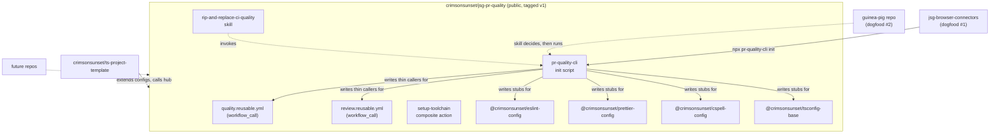

# PR Quality Hub Plan

**Status:** Planned — not started
**Last updated:** Aug 10, 2026
**Scope:** Turn the PR quality flow already proven in `jsg-browser-connectors` (Phases 1–5 of its own plan) into a reusable `crimsonsunset/jsg-pr-quality` hub: a `workflow_call` reusable workflow for CI orchestration, a set of shareable `@crimsonsunset/*` npm config packages for baseline lint/format/type rules, a CLI init script that writes all of it into a target repo, a GitHub template repo for greenfield bootstrap, and a Cursor skill that walks an agent through retrofitting an existing repo onto all of it.
**Related:** [PR Quality Flow Plan](https://github.com/crimsonsunset/jsg-browser-connectors/blob/feature/pr-quality-flow/docs/planning/pr-quality-flow-plan.md) (the in-repo build this hub extracts from — see its Phase 6)

---

## TL;DR

`jsg-browser-connectors` already runs the full flow: deterministic gates via an orchestrator script, a sticky PR comment, Semgrep/gitleaks/audit, and PR-Agent for AI review. That repo is the reference implementation, not a throwaway. This plan copies its working pieces out into a public hub other repos can point at.

Several things get built, not one, because the user wants all of it: a `workflow_call` hub for the CI plumbing, `@crimsonsunset/eslint-config` / `prettier-config` / `cspell-config` / `tsconfig-base` npm packages so "baseline lint and other quality rails" travel with the hub instead of being copy-pasted, and a `crimsonsunset/ts-project-template` repo for starting something new. A Cursor skill named `rip-and-replace-ci-quality` exists because dropping a README on someone doesn't retrofit an existing repo; an agent needs a repeatable procedure for tearing out ad-hoc lint/CI config and wiring in the shared one.

The skill doesn't hand-write every file itself, though. A `packages/cli` init script (`@crimsonsunset/pr-quality-cli`) does the mechanical part — writing config stubs, adding devDeps, writing the caller workflow YAML — deterministically and idempotently. The skill's job shrinks to what actually needs judgment: detecting what's already there, deciding what to remove, resolving repo-specific conflicts, then calling the script for the boilerplate. Scripted file writes are testable in isolation; an agent free-handing the same edits via its own judgment every single time is slower and more error-prone for pure boilerplate.

`jsg-browser-connectors` becomes the hub's first real caller (Phase 4) before anything else adopts it. The skill then gets proven against a second, previously-untouched repo (Phase 6) so "it works because I hand-migrated it" isn't the only evidence.

---

## Overview

**What this is:** A public `crimsonsunset/jsg-pr-quality` repo hosting a reusable CI workflow, four shareable config packages, a CLI init script, and an adoption skill — plus a separate `crimsonsunset/ts-project-template` repo for new projects.

**What this is NOT:**

- **Not a redesign of the flow itself** — the gate set (ESLint, `tsc`, build, Knip, cspell, Semgrep, gitleaks, `npm audit`, PR-Agent) and the sticky-report pattern are already decided and working in `jsg-browser-connectors`. This plan extracts and parameterizes, it doesn't re-litigate.
- **Not a codemod that rewrites application logic** — the CLI script only ever touches config files, `package.json` scripts/devDeps, and `.github/workflows/*.yml`. It never touches `shared/`, `sites/`, or any repo's actual source.
- **Not a full-fleet migration** — only `jsg-browser-connectors` (dogfood #1, hand-migrated) and one guinea-pig repo (dogfood #2, skill-migrated) move onto the hub in this plan. Every other personal repo adopts later, on demand, by running the skill.
- **Not a shared `knip.json`** — Knip needs explicit per-repo entry points (dynamically-loaded adapters, CLI mains) or it reports the whole surface as unused. That config stays local to each repo, same as it already is in `jsg-browser-connectors`.
- **Not test/coverage tooling** — `set-times-app`'s `ci:test` job stays local. No test runner is being standardized here.
- **Not a monorepo/Turbo adoption** — same reasoning as the source plan: full-repo checks are fast enough that changed-file scoping is overhead, not a fix.
- **Not new AI-review prompt content** — `.pr_agent.toml` and `review-standards.md` stay per-repo (conventions differ per repo); the hub only wraps the workflow that invokes PR-Agent.

**Dependency chain:**

```
Phase 1: reusable workflows + setup-toolchain composite action (self-tested against this repo)
  ↓
Phase 2: @crimsonsunset/* config packages (npm workspaces, published)
  ↓
Phase 3: pr-quality-cli init script (writes packages + workflows into a target repo)
  ↓
Phase 4: jsg-browser-connectors converted to thin caller via the CLI — dogfood #1
  ↓
Phase 5: crimsonsunset/ts-project-template — greenfield path
  ↓
Phase 6: rip-and-replace-ci-quality skill, proven against a second repo — dogfood #2
```

---

## Decisions

| #   | Decision                                                                                                                     | Rationale                                                                                                                                                                                                          |
| --- | ----------------------------------------------------------------------------------------------------------------------------- | -------------------------------------------------------------------------------------------------------------------------------------------------------------------------------------------------------------- |
| 1   | Extract now, from a working reference (`jsg-browser-connectors`), instead of designing the hub abstraction from scratch      | Mirrors the source plan's own Decision #3 — build it once, deliberately, then generalize. The shape is already proven; guessing at parameters up front risks over-engineering.                                   |
| 2   | Reusable workflow takes a `package-manager` input (`npm` \| `pnpm`), not npm-only                                             | `set-times-app` and `jsg-tech-check-site` are already on pnpm (`pnpm@10.30.2`, `pnpm@10.13.1`). An npm-only hub can't onboard them without a package-manager migration first, which is out of scope.              |
| 3   | Repo-specific check ownership (`scripts/ci/lint.script.mjs`, `ci:lint`) stays in each consumer repo; the hub only owns generic plumbing (checkout/setup/install/security scans/sticky report) | Carries forward the source plan's Decision #6. Keeps the hub from accumulating per-repo `if` branches as more repos adopt it.                                                                                     |
| 4   | Build `@crimsonsunset/eslint-config`, `prettier-config`, `cspell-config`, `tsconfig-base` as npm workspaces inside this same repo | User explicitly asked for "baseline lint and other quality rails" to come along for the ride. One repo versioning hub + configs together avoids coordinating releases across two repos for every change.        |
| 5   | Config packages publish to npm as public scoped packages (`npm publish --access public`)                                     | First publish under an unused scope (`@crimsonsunset`) defaults to private, which requires a paid npm plan. `--access public` keeps it free and matches the hub's own public visibility.                         |
| 6   | Config packages are thin, extendable exports — each repo keeps its own `eslint.config.mjs`/`tsconfig.json` that imports the shared base and layers repo-specific overrides on top | `jsg-browser-connectors` already needs its own overrides (alias-only imports, OpenCLI globals for bundled plugins). A single opaque "extends and you can't touch it" config would force a fork on day one.       |
| 7   | Also build `crimsonsunset/ts-project-template`, a separate public repo marked as a GitHub template, wired to the hub + config packages | User: "i want it all" — covers greenfield bootstrap, which the hub workflow and config packages alone don't solve (there's still no starter `package.json`/`eslint.config.mjs` to copy from).                    |
| 8   | Write a Cursor skill, `rip-and-replace-ci-quality`, to guide an agent through migrating an *existing* repo onto the hub        | Explicit user ask. Existing repos have ad-hoc lint/CI config that needs systematic removal (old devDeps, old config files, old workflow YAML), not just a README to read.                                        |
| 9   | `jsg-browser-connectors` is the hub's first caller, hand-migrated, before any other repo touches it                           | Dogfooding — proves the reusable workflow produces the same sticky report/reviewdog/PR-Agent behavior it's replacing, on the repo that already has real PR history to compare against.                          |
| 10  | Tag the hub `v1`; every caller pins to the tag, never `@main`                                                                 | Same supply-chain logic already applied to third-party actions in `jsg-browser-connectors` (pinned to SHAs). Once other repos depend on this hub, an unpinned `@main` caller is exactly the risk that was just fixed elsewhere. |
| 11  | Add a `packages/cli` init script (`@crimsonsunset/pr-quality-cli`) that writes config stubs, devDeps, and caller workflow YAML into a target repo; the skill calls it instead of hand-writing those files itself | User asked for "a script that moves things into place." Deterministic file writes are testable and idempotent on their own; leaving pure boilerplate to an agent's per-run judgment is slower and more error-prone than it needs to be. |
| 12  | The CLI is additive-only by default (skips files that already exist, `--force` to overwrite) and never touches application source, only config/`package.json`/`.github/workflows/*.yml` | Removing old, conflicting config is a judgment call (does this repo's ESLint override matter, is this workflow file safe to replace) — that stays with the skill, not the script, so the script can't destroy something it doesn't understand. |

---

## Scope

### In scope

**Hub workflows** (`crimsonsunset/jsg-pr-quality`)

- `.github/workflows/quality.reusable.yml` — `workflow_call` version of `jsg-browser-connectors`' `quality.on-pr.yml` (audit/quality/semgrep/gitleaks/report jobs), parameterized
- `.github/workflows/review.reusable.yml` — `workflow_call` version of `review.on-pr.yml` (PR-Agent), with `secrets` passthrough for `OPENROUTER__KEY`
- `.github/actions/setup-toolchain/action.yml` — composite action: `setup-node` + conditional `pnpm/action-setup`, install command branches on `package-manager` input
- `.github/workflows/self-test.on-pr.yml` — calls the two reusable workflows above against this repo itself
- Inputs: `node-version`, `package-manager`, `lint-script` (name of the caller's orchestrator npm script), `run-audit`/`run-semgrep`/`run-gitleaks` toggles

**Config packages** (npm workspaces, same repo)

- `packages/eslint-config` → `@crimsonsunset/eslint-config`
- `packages/prettier-config` → `@crimsonsunset/prettier-config`
- `packages/cspell-config` → `@crimsonsunset/cspell-config`
- `packages/tsconfig-base` → `@crimsonsunset/tsconfig-base`
- Published publicly to npm

**CLI init script**

- `packages/cli` → `@crimsonsunset/pr-quality-cli`, exposing a `pr-quality` bin with an `init` command
- Detects package manager from the lockfile, adds the four config packages as devDeps, writes config-file stubs and thin caller workflow YAML, adds missing npm scripts
- Additive by default (skips existing files), `--force` to overwrite, `--dry-run` to preview
- Idempotent — safe to re-run when the hub or config packages ship a new version

**Dogfood #1**

- `jsg-browser-connectors`' two workflow files rewritten as thin callers pinned to `jsg-pr-quality@v1`
- `jsg-browser-connectors`' `eslint.config.mjs`/`.prettierrc`/`cspell.json`/`tsconfig.json` rewritten to import/extend the four shared packages

**Template repo**

- New public `crimsonsunset/ts-project-template`, flagged as a GitHub template repo
- Starter `package.json`, config files extending the shared packages, thin caller workflows pinned to `v1`, bootstrap README

**Adoption skill**

- `skills/rip-and-replace-ci-quality/SKILL.md` authored in this repo, symlinked into `~/.cursor/skills/rip-and-replace-ci-quality/` (same convention as `project-cursor-rules-central`)
- Detects existing setup and decides what to remove, then calls `pr-quality-cli init` for the mechanical writes — it doesn't hand-edit config files itself
- Proven end-to-end against one previously-untouched repo (dogfood #2)

### Out of scope

- **Migrating every personal repo onto the hub** — only the two dogfood repos move in this plan; the rest adopt later, on demand, via the skill
- **A shared Knip config package** — Knip's entry-point config is inherently repo-specific (dynamically-loaded adapters, CLI mains); forcing it into a shared package would just reintroduce the noise problem the source plan already solved per-repo
- **Test/coverage gates in the hub** — `set-times-app`'s test job stays local; no test runner is being standardized
- **Monorepo/Turbo-aware scoping in the hub** — full-repo checks are fast enough across the target repos that changed-file scoping isn't solving a real problem yet
- **New AI-review prompt content** — `.pr_agent.toml` and `review-standards.md` stay per-repo; the hub only supplies the `workflow_call` wrapper around PR-Agent
- **Private-repo-specific handling** — the hub is public, which means both public and private callers can use it (public reusable workflows are callable from anywhere); nothing private-only is being solved

---

## Architecture



### Check ownership

| Layer                                                        | Owner                                                             | Why                                          |
| -------------------------------------------------------------- | ------------------------------------------------------------------ | --------------------------------------------- |
| Which checks exist, what they run                              | `scripts/ci/lint.script.mjs` (per repo)                            | Repo-specific; hub stays generic (Decision #3) |
| Node/pnpm setup, install, cache, security scans, sticky report  | `jsg-pr-quality` reusable workflows + `setup-toolchain`             | Identical across repos                        |
| Baseline lint/format/type rules                                | `@crimsonsunset/*` config packages                                 | Shared, versioned, extendable (Decision #6)   |
| Model, prompt, review standards                                | `.pr_agent.toml` + `review-standards.md` (per repo)                | Conventions differ per repo                   |
| Mechanical file writes (config stubs, devDeps, caller YAML)    | `pr-quality-cli init`                                              | Deterministic, testable, idempotent (Decision #11) |
| Judgment calls (what to remove, how to resolve conflicts)      | `rip-and-replace-ci-quality` skill                                 | Needs repo-specific reasoning, not scriptable (Decision #12) |
| Bootstrap for a brand-new repo                                 | `crimsonsunset/ts-project-template`                                | Greenfield path (Decision #7)                 |
| Retrofit for an existing repo                                  | `rip-and-replace-ci-quality` skill + `pr-quality-cli`               | Existing repos need teardown, not just docs   |

---

## Files to create / modify

### Create — hub workflows & composite action

| File                                                                     | Purpose                                                                    |
| -------------------------------------------------------------------------- | ----------------------------------------------------------------------------- |
| [.github/workflows/quality.reusable.yml](../../.github/workflows/quality.reusable.yml) | `workflow_call` version of the audit/quality/semgrep/gitleaks/report jobs     |
| [.github/workflows/review.reusable.yml](../../.github/workflows/review.reusable.yml)   | `workflow_call` version of the PR-Agent job                                   |
| [.github/actions/setup-toolchain/action.yml](../../.github/actions/setup-toolchain/action.yml) | Composite: `setup-node` + conditional `pnpm/action-setup` + install         |
| [.github/workflows/self-test.on-pr.yml](../../.github/workflows/self-test.on-pr.yml)    | Calls the two reusable workflows above against this repo, before `v1` is tagged |
| [package.json](../../package.json)                                       | Root: `"workspaces": ["packages/*"]`, engines, root devDeps                    |

### Create — config packages

| File                                                        | Purpose                                                       |
| --------------------------------------------------------------- | ----------------------------------------------------------------- |
| [packages/eslint-config/index.mjs](../../packages/eslint-config/index.mjs)     | `@crimsonsunset/eslint-config` — base `tseslint.config(...)` array |
| [packages/prettier-config/index.js](../../packages/prettier-config/index.js)   | `@crimsonsunset/prettier-config` — shared `.prettierrc` object      |
| [packages/cspell-config/cspell.json](../../packages/cspell-config/cspell.json) | `@crimsonsunset/cspell-config` — base dictionary                    |
| [packages/tsconfig-base/tsconfig.base.json](../../packages/tsconfig-base/tsconfig.base.json) | `@crimsonsunset/tsconfig-base` — strict base compiler options       |

### Create — CLI init script

| File                                                        | Purpose                                                                    |
| --------------------------------------------------------------- | ------------------------------------------------------------------------------ |
| [packages/cli/bin/pr-quality.mjs](../../packages/cli/bin/pr-quality.mjs)      | `#!/usr/bin/env node` entry point, parses `init`/`--force`/`--dry-run`         |
| [packages/cli/lib/init.mjs](../../packages/cli/lib/init.mjs)                  | Detects package manager, writes config stubs + devDeps + caller workflow YAML |
| [packages/cli/templates/](../../packages/cli/templates/)                      | Template files for `eslint.config.mjs`, `.prettierrc`, `tsconfig.json`, `quality.on-pr.yml`, `review.on-pr.yml` that `init.mjs` copies/fills in |
| [packages/cli/package.json](../../packages/cli/package.json)                  | `@crimsonsunset/pr-quality-cli`, `"bin": { "pr-quality": "bin/pr-quality.mjs" }` |

### Create — adoption skill & docs

| File                                                                     | Purpose                                                             |
| --------------------------------------------------------------------------- | ----------------------------------------------------------------------- |
| [skills/rip-and-replace-ci-quality/SKILL.md](../../skills/rip-and-replace-ci-quality/SKILL.md) | Agent procedure for retrofitting an existing repo onto the hub          |
| [README.md](../../README.md)                                             | Adoption README: greenfield (template) vs. existing repo (skill) paths |

### Create — template repo (separate `crimsonsunset/ts-project-template`)

| File                     | Purpose                                                          |
| -------------------------- | ------------------------------------------------------------------- |
| `package.json`             | Depends on all four `@crimsonsunset/*` packages as devDeps          |
| `eslint.config.mjs`         | Imports `@crimsonsunset/eslint-config`, no overrides                |
| `.prettierrc`               | Imports `@crimsonsunset/prettier-config`                             |
| `tsconfig.json`             | `"extends": "@crimsonsunset/tsconfig-base"`                          |
| `.github/workflows/*.yml`   | Thin callers pinned to `jsg-pr-quality@v1`                           |
| `README.md`                 | "Use this template" bootstrap instructions                          |

### Modify — `jsg-browser-connectors` (dogfood #1)

| File                                          | Change                                                                       |
| ------------------------------------------------ | -------------------------------------------------------------------------------- |
| `.github/workflows/quality.on-pr.yml`             | `npx @crimsonsunset/pr-quality-cli init` writes this as a thin caller (`uses: crimsonsunset/jsg-pr-quality/.github/workflows/quality.reusable.yml@v1`, `secrets: inherit`); hand-verified after |
| `.github/workflows/review.on-pr.yml`              | Same script run, pointed at `review.reusable.yml@v1`                             |
| `eslint.config.mjs`                               | CLI writes the base import; repo's own alias-import + OpenCLI-globals overrides added back by hand afterward |
| `.prettierrc`, `cspell.json`, `tsconfig.json`      | CLI writes the extends-boilerplate for each                                      |
| `docs/planning/pr-quality-flow-plan.md`           | Phase 6 marked done, linking to this doc                                         |

---

## Phasing

### Phase 1: Reusable workflows + composite action, self-tested

Roughly one day.

- Scaffold `jsg-pr-quality`'s root `package.json` with `"workspaces": ["packages/*"]`
- Port `quality.on-pr.yml`'s five jobs into `quality.reusable.yml` under `on: workflow_call`, with `inputs` for `node-version`, `package-manager`, `lint-script`, and per-scan toggles; install step branches on `package-manager`
- Port `review.on-pr.yml` into `review.reusable.yml` under `on: workflow_call`, `secrets` block for `openrouter-key`
- Write `setup-toolchain/action.yml`: `actions/setup-node@v6` always, `pnpm/action-setup@v5` only when `package-manager == 'pnpm'`, then the matching install command
- Write `self-test.on-pr.yml` that calls both reusable workflows against this repo's own (currently empty) codebase
- Open a PR against `jsg-pr-quality` itself, confirm the self-test run is green, tag `v1`

**Outcome:** A PR against `jsg-pr-quality` triggers its own reusable workflow calling itself and posts a sticky report — the `workflow_call` plumbing is proven before any external repo depends on it.

---

### Phase 2: Shareable config packages

Roughly half a day.

- Scaffold `packages/eslint-config`, `packages/prettier-config`, `packages/cspell-config`, `packages/tsconfig-base`, each with its own `package.json`
- `eslint-config`: export `jsg-browser-connectors`' base `tseslint.config(...)` array minus repo-specific rules (alias-import restriction, OpenCLI globals exception) — those stay in the consumer
- `prettier-config`: export the same `.prettierrc` object as a module
- `cspell-config`: export the base dictionary/word list, minus repo-specific vocabulary
- `tsconfig-base`: strict base compiler options for consumers to `extend`
- `npm publish --access public` all four at `0.1.0`

**Outcome:** Four public `@crimsonsunset/*` packages exist on npm, installable independently of the hub's CI workflow.

---

### Phase 3: `pr-quality-cli` init script

Roughly half a day.

- Scaffold `packages/cli` as a fifth workspace package, `@crimsonsunset/pr-quality-cli`, with a `bin/pr-quality.mjs` entry and `"bin": { "pr-quality": "bin/pr-quality.mjs" }`
- `init` command: detect `pnpm-lock.yaml` vs `package-lock.json` to pick `package-manager`; add the four config packages as devDeps; write `eslint.config.mjs`/`.prettierrc`/`cspell.json`/`tsconfig.json` stubs from `packages/cli/templates/` (skip if the file already exists, unless `--force`); write `.github/workflows/quality.on-pr.yml`/`review.on-pr.yml` as thin callers pinned to `v1`; add missing `lint:*`/`format*`/`ci:lint` npm scripts without clobbering existing custom ones
- `--dry-run` prints a diff-style preview without writing anything
- Test it against a disposable scratch directory (`npm init -y` into `/tmp`, run `npx --prefix . pr-quality init`, inspect the result) before pointing it at a real repo
- `npm publish --access public` alongside the config packages

**Outcome:** `npx @crimsonsunset/pr-quality-cli init` run inside an empty scratch project produces working config files and caller workflows without any manual editing.

---

### Phase 4: `jsg-browser-connectors` becomes the hub's first caller

Roughly half a day.

- Run `npx @crimsonsunset/pr-quality-cli init` inside `jsg-browser-connectors` to write the thin caller workflows and config stubs
- Hand-add back the repo-specific overrides the CLI can't know about: the alias-import restriction and OpenCLI-globals exception in `eslint.config.mjs`
- Open a real PR, confirm the sticky report, reviewdog annotations, and PR-Agent review all fire identically to before the swap
- Update the source plan's Phase 6 status to done, linking here

**Outcome:** `jsg-browser-connectors` has ~10-line workflow files and config files that are mostly one-line extends, produced by the CLI rather than hand-written, and a real PR proves the externally-hosted hub matches the in-repo version it replaced.

---

### Phase 5: `ts-project-template`

Roughly half a day.

- Create public `crimsonsunset/ts-project-template`
- Seed `package.json` (devDeps on all four config packages), `eslint.config.mjs`, `.prettierrc`, `tsconfig.json`, thin caller workflows pinned to `v1`, bootstrap README
- Flag the repo as a GitHub template (`gh api repos/crimsonsunset/ts-project-template -X PATCH -f is_template=true`)
- Use the template to spin up a throwaway repo, confirm CI is green on the first commit with zero manual config

**Outcome:** A brand-new project created from the template passes its first PR's quality checks with no copy-pasting from an existing repo.

---

### Phase 6: `rip-and-replace-ci-quality` skill, proven on a second repo

Roughly one day, most of it spent on the second repo's actual quirks.

- Author `skills/rip-and-replace-ci-quality/SKILL.md`: detect existing lint/CI setup → decide what's superseded and safe to remove (old devDeps, old config files, old workflow YAML) → run `npx @crimsonsunset/pr-quality-cli init` for the mechanical writes → hand-resolve anything the CLI skipped or that needs a repo-specific override → run lint/build locally → open a PR and confirm the hub's checks pass
- Symlink it into `~/.cursor/skills/rip-and-replace-ci-quality/`, matching the existing `project-cursor-rules-central` symlink convention
- Pick a guinea-pig repo not touched by Phase 4 (e.g. `jsg-tech-check-site`, already on pnpm, no CI yet) and run the skill against it end to end
- Fix whatever the skill (or the CLI, if it's the CLI's fault) gets wrong on real repo #2 — Phase 4 was hand-guided, so it doesn't validate the skill itself

**Outcome:** Running the skill against a second, previously untouched repo leaves it with green lint/build, a real PR carrying a hub-driven quality report, and no leftover ad-hoc config files — proving the skill and the CLI it drives actually work together, not just the hub.

---

## Key files referenced

| Path                                                                                                  | Note                                                                          |
| -------------------------------------------------------------------------------------------------------- | ---------------------------------------------------------------------------------- |
| `jsg-browser-connectors/.github/workflows/quality.on-pr.yml`                                              | Source for `quality.reusable.yml` — audit/quality/semgrep/gitleaks/report jobs      |
| `jsg-browser-connectors/.github/workflows/review.on-pr.yml`                                               | Source for `review.reusable.yml` — PR-Agent job, bot-push `if` logic already fixed  |
| `jsg-browser-connectors/scripts/ci/lint.script.mjs`                                                       | Orchestrator pattern the hub does *not* absorb — stays per-repo (Decision #3)       |
| `jsg-browser-connectors/eslint.config.mjs`                                                                | Source for `@crimsonsunset/eslint-config`'s base rules                              |
| `set-times-app/.github/workflows/quality.on-pr.yml`                                                       | Confirms the pnpm install pattern (`pnpm/action-setup@v5`, `cache: 'pnpm'`) the composite action must replicate |
| `jsg-tech-check-site/package.json`                                                                        | `packageManager: pnpm@10.13.1` — likely dogfood #2 candidate for Phase 6             |
| `~/.cursor/rules/project-cursor-rules-central.mdc`                                                         | Existing symlink convention the skill's `~/.cursor/skills/` placement follows        |
| [PR Quality Flow Plan](https://github.com/crimsonsunset/jsg-browser-connectors/blob/feature/pr-quality-flow/docs/planning/pr-quality-flow-plan.md) | The in-repo build this hub extracts from; its Phase 6 is what this doc replaces with real detail |

---

## Related documentation

- [PR Quality Flow Plan](https://github.com/crimsonsunset/jsg-browser-connectors/blob/feature/pr-quality-flow/docs/planning/pr-quality-flow-plan.md)
- [Reusing workflows](https://docs.github.com/en/actions/how-tos/reuse-automations/reuse-workflows)
- [Creating a template repository](https://docs.github.com/en/repositories/creating-and-managing-repositories/creating-a-template-repository)
- [npm workspaces](https://docs.npmjs.com/cli/v11/using-npm/workspaces)
- [Publishing scoped public packages](https://docs.npmjs.com/creating-and-publishing-scoped-public-packages)

---

## Progress Log

### 2026-08-10 — Plan written

- Surveyed `set-times-app` and `jsg-tech-check-site` to confirm pnpm is already in real use across the target repo fleet, not just a hypothetical
- Confirmed `crimsonsunset/jsg-pr-quality` exists on GitHub, public, empty (no commits, no default branch yet); cloned locally
- Decisions locked: all three approaches (reusable workflow, config packages, template repo) plus a rip-and-replace skill, `jsg-browser-connectors` as first caller before any other repo, `v1` tag pinning, public npm scope
- Added a `pr-quality-cli init` script (Phase 3) after the user asked for something that "moves things into place" — the skill now drives the CLI for mechanical writes instead of hand-editing every config file itself; renumbered Phases 3–5 to 4–6 accordingly

---

## Notes & Decisions

- **This repo is currently empty.** Everything in "Files to create" is net-new; there is no existing structure to preserve or migrate from inside `jsg-pr-quality` itself.
- **The config packages must stay thin.** The moment one of them tries to be a complete, non-extendable config, the first repo with a real exception (OpenCLI's `.main.js` globals, `sites/*/opencli/**` ignores) forces a fork instead of an override. Decision #6 exists specifically to prevent that.
- **`self-test.on-pr.yml` calling the hub's own reusable workflow is the cheapest possible integration test.** No separate consumer repo is needed to catch a broken `workflow_call` input/output wiring — it fails on the hub's own next PR.
- **Phase 4 (hand-guided CLI run) does not validate Phase 6's skill.** Those are deliberately separate proofs: Phase 4 proves the hub and CLI work, Phase 6 proves the *skill* can drive that same CLI without a human deciding what to remove first.
- **The CLI has to stay dumber than the skill on purpose.** If `pr-quality-cli init` starts trying to guess which existing config is safe to delete, it becomes a second, less-capable copy of the skill's judgment logic. Keeping it additive-only (Decision #12) is what makes it safe to run blind in Phase 4, before the skill even exists.
