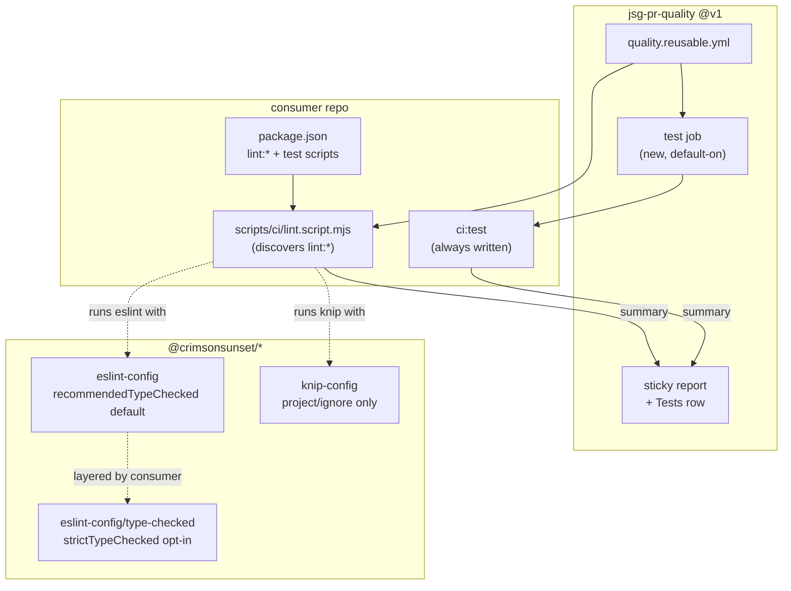

# Quality Capability Hardening Plan

**Status:** Done. Phases 1–5 shipped at `0.1.4`. Dogfood (hub-extraction Phase 6) ran against `karakeep-instagram-relay`: local `ci:lint`/`ci:test` green; consumer PR opened. Dogfood forced hub fixes through `0.1.11` (see Progress Log — PR-Agent `PR_AGENT_CONFIG_BRANCH`).
**Last updated:** Aug 11, 2026
**Scope:** Raise what the hub actually *detects*, as opposed to how well it is assembled. Opens the orchestrator's closed check list, makes type-aware ESLint the default instead of an unused opt-in, gives plain-JS consumers a type-checking path, turns tests and knip into default-on gates (reversing two exclusions from the extraction plan), wires a build gate where one exists, and recalibrates `npm audit` so it stops being permanently red.
**Related:** [PR Quality Hub Plan](./hub-extraction-plan.md) (built the hub this hardens — its Phase 6 dogfood depends on this work)

---

## TL;DR

The hub's config packages were reviewed once already, on Aug 11, and that review graded construction: peerDependency ranges, export maps, vocabulary scoping, whether the packages load cleanly. All worthwhile, none of it changed what gets caught. Of six workstreams in that pass, exactly one improved detection (`tsconfig-base` strict flags, TS repos only) and one added detection that is off by default (`type-checked`).

The suite as shipped is strong on formatting, spelling, secrets, and dependency CVEs, and weak on correctness. `@crimsonsunset/eslint-config`'s default export is `recommended` plus `stylistic`, which means the highest-value rules in the ecosystem (`no-floating-promises`, `no-misused-promises`, `await-thenable`) are sitting in an opt-in entry point that zero repos import. The `stylistic` tier added in that review catches no defects at all.

Two capabilities the audit initially flagged as regressions are not regressions: the extraction plan's "What this is NOT" section deliberately excluded a shared knip config (entry points are inherently per-repo) and test tooling (`set-times-app`'s `ci:test` stays local). Those rationales were sound at the time. **Both exclusions are reversed here, and both ship on by default** (Decisions #7 and #8). Leaving them as detected-or-skipped would have repeated the exact mistake the audit exists to call out: `type-checked` was available, correct, and imported by nobody.

Default-on for tests needs one accommodation, because most target repos have no suite at all. The gate is always wired, and when no test files exist it reports "none found" rather than passing quietly or failing loudly. The wiring being present is what matters: the day someone adds a first test file, it is gated with no config change.

That orchestrator problem is the real foundation, and it is newly introduced. The generic `lint.script.mjs` shipped in `0.1.2` runs a hardcoded list of four checks. `set-times-app` already has `lint:knip`, `lint:stylelint`, and `lint:json`; a consumer like that running `pr-quality-cli init` gets an orchestrator that silently ignores three of its gates and a sticky report that lies about coverage. Nothing else in this plan matters until the orchestrator can discover what a repo actually runs.

---

## Overview

**What this is:** A detection-capability pass over the shipped hub. Five phases, each ending in a lockstep version bump, ordered so the orchestrator can see new checks before any new checks are added.

**What this is NOT:**

- **Not a rewrite of the hub's architecture** — the reusable workflow, the config packages, the CLI, and the check-ownership split (extraction plan's Decision #3) all stay exactly as they are. This changes rule sets and adds jobs, not structure.
- **Not a re-litigation of the packaging review** — the peerDependency ranges, export maps, and `>=` ranges from Aug 11 were correct and are untouched.
- **Not opt-in gating** — tests and knip are on by default (Decisions #7, #8). Each stays *disableable* through a workflow input for the rare repo that needs it off, but the default is on and nobody has to discover a flag to get coverage.
- **Not a hard failure on repos without tests** — default-on means always wired, not always red. A repo with zero test files reports "none found" (Decision #7a), which is honest without blocking adoption.
- **Not `strictTypeChecked` by default** — the aggressive tier stays opt-in. Turning on 60-odd type-aware rules across an existing repo is a migration, not a config flip (Decision #3).
- **Not `checkJs` on by default for existing JS repos** — same reasoning. It ships as a documented flag and as the greenfield template's default, not as something `init` silently switches on.
- **Not custom Semgrep rules** — the CE rulesets are pulling their weight; authoring house rules is a separate exercise with its own maintenance cost.
- **Not coverage thresholds** — running tests at all is the gap. Gating on a coverage number is a later argument, and a noisy one.

**Dependency chain:**

```
Phase 1: orchestrator discovers lint:* scripts (unblocks everything below)
  ↓
Phase 2: type-aware ESLint default for TS, checkJs path for JS
  ↓
Phase 3: tests as a first-class gate (test-script input + default-on job)
  ↓
Phase 4: revisit knip + build gate, now that the orchestrator can run them
  ↓
Phase 5: recalibrate npm audit, add eslint-plugin-n + import-x
  ↓
(then) karakeep-instagram-relay dogfood — see hub-extraction-plan Phase 6
```

---

## Decisions

| #   | Decision                                                                                                                   | Rationale                                                                                                                                                                                                                                                                        |
| --- | -------------------------------------------------------------------------------------------------------------------------- | -------------------------------------------------------------------------------------------------------------------------------------------------------------------------------------------------------------------------------------------------------------------------------- |
| 1   | Harden before dogfooding `karakeep-instagram-relay`, not after                                                             | Dogfooding onto today's defaults produces a green PR that proves the plumbing and nothing about the linting. That repo is a plain-JS Node service whose real risk is unawaited promises in concurrent carousel enrichment — the exact class the current default config cannot see. A green check there would be actively misleading. |
| 2   | The orchestrator discovers `lint:*` scripts from `package.json` instead of hardcoding a list                                | `set-times-app` already runs `lint:knip`, `lint:stylelint`, and `lint:json`. A fixed four-item list means the CLI writes an orchestrator that silently drops a consumer's existing gates while reporting "All blocking checks passed" — worse than not running them, because the sticky report asserts coverage that does not exist. |
| 3   | Default type-aware tier is `recommendedTypeChecked`, not `strictTypeChecked`; the strict tier stays as the `type-checked` export | `recommendedTypeChecked` carries the rules that actually catch defects (`no-floating-promises`, `no-misused-promises`, `await-thenable`, `no-unnecessary-type-assertion`) without the `strictTypeChecked` noise floor (`no-unsafe-*` on every untyped boundary). Default-on beats theoretically-better-but-unused, which is the whole lesson of the audit. |
| 4   | Type-aware linting turns on only when a `tsconfig.json` exists, detected by the CLI at init time                            | Type-aware rules need a real project service. Writing an `eslint.config.mjs` that references a tsconfig the repo does not have is the same class of bug as the `lint:tsc`-without-any-`.ts`-files failure already fixed in `0.1.1`.                                              |
| 5   | Plain-JS consumers get `allowJs`/`checkJs` as an opt-in `init --js-typecheck` flag, and as the default in a new `templates/js-project/` | `checkJs` on an existing untyped JS codebase surfaces hundreds of findings at once, which gets the whole gate disabled rather than fixed. Greenfield can afford it on day one; retrofits need it to be a deliberate choice with a migration behind it. Explicitly reconfirmed against the default-on push behind #7 and #8: knip and tests are cheap to switch on, `checkJs` is a migration, so it stays the one deliberate opt-in. |
| 6   | Tests run as a separate `test` job driven by a `test-script` input, not folded into `ci:lint`                               | Mirrors the split `set-times-app` already uses (`ci:lint` and `ci:test` as distinct orchestrators). Tests have different runtimes, different flakiness, and different log-reading needs than lint; collapsing them into one job makes both harder to triage.                    |
| 7   | Tests are on by default: `test-script` defaults to `ci:test`, `run-tests` defaults to true, and the CLI always writes the test orchestrator                | Reverses the extraction plan's test exclusion, at the user's direction. Detected-or-skipped would mean most repos never get tests wired, which is the same defaults failure the audit was written about. A gate that exists but is off has no capability. |
| 7a  | A repo with no test files reports "none found" instead of passing or failing                                                | Default-on has to mean always wired, not always red, or nothing adopts it. Reporting a distinct third state keeps the sticky report honest (an empty suite is not a passing suite) while leaving the wiring in place so the first real test file is gated automatically. |
| 8   | knip is on by default: `@crimsonsunset/knip-config` ships `project`/`ignore`, the CLI pre-populates `entry` from the target repo, and `lint:knip` is always wired | Reverses the extraction plan's knip exclusion, at the user's direction. The original objection was specifically about `entry`, so the CLI answers it by deriving entries from `package.json` (`main`, `bin`, `exports`) plus `scripts/*.mjs` and `src/index.*`, on top of knip's own plugin inference. The shared package still never sets `entry` itself. |
| 8a  | First knip run on an existing repo is expected to produce findings, and cleanup is part of adoption                          | knip's whole job is reporting things nobody references. Turning it on without a cleanup commit is not a reason to keep it off, but the skill has to expect that commit rather than treating red knip as a misconfiguration. |
| 9   | `lint:build` is wired by the CLI only when the target repo already has a `build` script                                     | Same detection discipline as Decisions #4 and #7. A build gate on a repo with no build step is a guaranteed red check.                                                                                                                                                            |
| 10  | `npm audit` drops from `--audit-level=low` to `moderate` and adds `--omit=dev`                                              | A check that is always red has zero capability regardless of its sensitivity. `low` on transitive dev dependencies produces findings that are frequently unfixable and never exploitable in CI, which trains everyone to ignore the one place real advisories appear.            |
| 11  | Add `eslint-plugin-n` and `eslint-plugin-import-x` to the base, scoped so browser consumers are unaffected                  | Unresolved imports, missing dependencies, and circular imports are real defect classes that neither `tsc` nor Semgrep reports, and they are the classes a Node service repo hits most. Scoping matters because `jsg-browser-connectors` is browser-context code and `n/*` rules would misfire on it. |
| 12  | Keep the `stylistic` tier in the base rather than removing it                                                               | It catches nothing, but it is already shipped, it is Prettier-compatible, and pulling it now would churn every consumer's diff for zero detection change. Documented honestly as cosmetic instead of quietly counted as a quality gate.                                            |
| 13  | Every phase ends in a lockstep `0.1.x` bump across all packages, published by tag push                                      | Established in `0.1.2` after `npm publish --workspaces` aborted mid-batch on unbumped packages. Per-package versioning saves nothing here and reintroduces that failure mode.                                                                                                     |
| 14  | No Airbnb lineage, including the maintained flat-config forks                                                              | `eslint-config-airbnb` has been unmaintained since 2021, `eslint-config-airbnb-typescript` is archived, and ESLint 10 removed the `.eslintrc` format it depends on. Beyond maintenance it is the wrong shape: the flat-config port dropped 104 of its 350 rules as obsolete or redundant, roughly 60 of them formatting rules that would fight Prettier. What survives after subtracting style is thin, because it is a style guide and this hub is a defect-detection tool. |
| 15  | Add `eslint-plugin-unicorn` at the `unopinionated` preset, never `recommended`                                             | `recommended` is where the "too strict" reputation comes from: `prevent-abbreviations` renaming `req` to `request`, plus `no-null`, `filename-case`, and `no-array-reduce`. `unopinionated` exists specifically to drop those 17 subjective rules, leaving the async and promise correctness set that is the single highest-value addition available: `no-unsafe-promise-all-settled-values`, `no-await-in-promise-methods`, `no-async-promise-finally`, `no-useless-promise-resolve-reject`, `no-invalid-fetch-options`, and `no-abusive-eslint-disable`. |
| 16  | Skip the `eslint-plugin-sonarjs` preset; revisit individual rules later if wanted                                          | Its catalog re-exports dozens of unicorn rules under `S77xx` IDs, so enabling both presets means duplicate reports on the same line. Its genuinely unique contributions (`cognitive-complexity`, `no-identical-functions`, `no-duplicated-branches`) are maintainability signals, and PR-Agent already comments on maintainability. |
| 17  | The base declares an ESLint `>=10` floor and the skill pre-flights consumers for it                                        | ESLint 9 reached end-of-life on 2026-08-06 and v10 removed `.eslintrc` outright, so any retrofit target still on 8 or 9 needs a major-version migration before the hub can install. v10 also added `no-unassigned-vars`, `no-useless-assignment`, and `preserve-caught-error` to `eslint:recommended`, which land as new findings on first adoption. |

---

## Scope

### In scope

**Orchestrator (`packages/cli/templates/lint.script.mjs` and its two synced copies)**

- Discover `lint:*` scripts from the consumer's `package.json` rather than a hardcoded list
- Keep `format:check` first and a known label map for pretty sticky-report names (`lint:tsc` → TypeScript, `lint:knip` → Knip)
- Deterministic ordering so the sticky table does not reshuffle between runs
- Unknown `lint:*` scripts still run, labeled from their script name

**ESLint config package**

- New default-on type-aware tier at `recommendedTypeChecked`, applied only when the consumer wires `parserOptions`
- Existing `type-checked` export retargeted as the explicit `strictTypeChecked` opt-in
- `eslint-plugin-n` at `recommended`, scoped to `scripts/**` and Node-context files
- `eslint-plugin-unicorn` at the `unopinionated` preset, for its async and promise correctness rules
- `eslint-plugin-import-x` resolver rules for unresolved imports and cycles
- Explicit `eslint >=10` peer floor, since v9 is end-of-life as of 2026-08-06

**Reusable workflow**

- `test-script` input defaulting to `ci:test`, plus a `test` job that runs by default
- `run-tests` toggle (default true) for parity with the existing scan toggles
- Sticky report gains a Tests row with three states (passed, failed, none found), and the required-jobs gate accounts for it
- `npm audit` recalibrated per Decision #10

**CLI**

- Always writes `ci:test` and a `test.script.mjs` orchestrator; detection only picks *which* runner it invokes and whether any test files exist
- Detects a `build` script and wires `lint:build`
- Always writes `knip.config.js` spreading the shared `@crimsonsunset/knip-config` defaults, with `entry` pre-populated from `package.json` `main`/`bin`/`exports`, `scripts/*.mjs`, and `src/index.*`
- New `--js-typecheck` flag writing `allowJs`/`checkJs` and enabling `lint:tsc` for JS repos
- Writes the type-aware `eslint.config.mjs` variant when a tsconfig is present

**New packages and templates**

- `packages/knip-config` → `@crimsonsunset/knip-config`
- `templates/js-project/` — plain-JS greenfield starter with `checkJs` on from the start

### Out of scope

- **Custom Semgrep rulesets** — CE coverage is adequate; house rules are a separate effort with ongoing maintenance, not a config change
- **Any Airbnb-derived preset** — Decision #14. Settled, not revisited per-repo
- **`eslint-plugin-sonarjs`** — Decision #16. Individual rules stay available to cherry-pick later; the preset does not come in
- **Replacing Prettier with lint-driven formatting** — rules out `@antfu/eslint-config` and `eslint-config-flat-airbnb`'s `stylistic: true` mode, both of which format via ESLint. The Prettier split is working and is not what the audit flagged
- **Coverage thresholds or reporting** — deferred until tests actually run in CI across more than one repo; gating on a percentage before that is premature
- **`exactOptionalPropertyTypes` in `tsconfig-base`** — still deliberately omitted, same rationale as the existing inline comment in `tsconfig.base.json`
- **Removing the `stylistic` tier** — Decision #12; churn without detection gain
- **Standardizing a test runner** — tests are default-on, but the orchestrator resolves whatever runner the repo already has. Picking vitest for everyone is a fleet decision this plan does not need to make
- **Writing tests for repos that have none** — the gate ships wired and reports "none found." Authoring an actual suite for `karakeep-instagram-relay` or anything else is separate work
- **Stylelint / CSS linting in the base** — `set-times-app` has `lint:stylelint` locally and Phase 1 makes the orchestrator run it. Shipping a shared stylelint config is only worth it once a second repo needs one
- **Migrating other repos onto the hardened config** — `karakeep-instagram-relay` is the dogfood (hub-extraction plan Phase 6); the rest adopt on demand
- **PR-Agent prompt or model changes** — unrelated to deterministic detection; `.pr_agent.toml` stays per-repo

---

## Architecture



### What each layer detects after this plan

| Layer                                   | Catches                                                                | Status after plan     |
| --------------------------------------- | ---------------------------------------------------------------------- | --------------------- |
| ESLint base + `recommendedTypeChecked`  | Floating/misused promises, unsafe assertions, undefined vars           | Default-on for TS     |
| `eslint-config/type-checked`            | Full `strictTypeChecked` surface                                       | Opt-in, unchanged     |
| `eslint-plugin-n` + `import-x`          | Unresolved imports, missing deps, circular imports, `process.exit`     | Default-on, scoped    |
| `tsc --noEmit`                          | Type errors, null paths, unchecked index access                        | TS, or JS via flag    |
| Tests (`ci:test`)                       | Behavioral regressions                                                 | New, default-on       |
| knip                                    | Dead files, unused exports, unused dependencies                        | New, default-on       |
| Build (`lint:build`)                    | Broken builds that lint alone misses                                   | New, detected         |
| Semgrep + Gitleaks                      | Injection, unsafe patterns, committed secrets                          | Unchanged             |
| `npm audit`                             | Exploitable published CVEs                                             | Recalibrated          |
| Prettier + cspell                       | Formatting, typos                                                      | Unchanged, cosmetic   |

---

## Files to create / modify

### Modify — orchestrator templates (Phase 1)

| File                                                                                                       | Change                                                                     |
| ---------------------------------------------------------------------------------------------------------- | -------------------------------------------------------------------------- |
| [packages/cli/templates/lint.script.mjs](../../packages/cli/templates/lint.script.mjs)                     | Replace the fixed `CHECKS` array with `lint:*` discovery plus a label map   |
| [templates/ts-project/scripts/ci/lint.script.mjs](../../templates/ts-project/scripts/ci/lint.script.mjs)   | Kept byte-identical to the CLI template                                    |
| [scripts/ci/lint.script.mjs](../../scripts/ci/lint.script.mjs)                                             | Same, so the hub keeps dogfooding its own orchestrator                      |

### Modify — ESLint config (Phases 2, 5)

| File                                                                       | Change                                                                                  |
| -------------------------------------------------------------------------- | --------------------------------------------------------------------------------------- |
| [packages/eslint-config/index.mjs](../../packages/eslint-config/index.mjs) | Add `eslint-plugin-n` (scoped) and `import-x` rules; document `stylistic` as cosmetic     |
| [packages/eslint-config/recommended-type-checked.mjs](../../packages/eslint-config/)  | New default-on type-aware tier, scoped to TS files via the existing `scopeToTsFiles` helper |
| [packages/eslint-config/type-checked.mjs](../../packages/eslint-config/type-checked.mjs) | Reframed in JSDoc as the `strictTypeChecked` opt-in, behavior unchanged                  |
| [packages/eslint-config/package.json](../../packages/eslint-config/package.json)       | New export path, new peerDeps for `eslint-plugin-n` / `eslint-plugin-import-x`            |

### Modify — reusable workflow (Phases 3, 5)

| File                                                                                       | Change                                                                       |
| ------------------------------------------------------------------------------------------ | ---------------------------------------------------------------------------- |
| [.github/workflows/quality.reusable.yml](../../.github/workflows/quality.reusable.yml)     | `test-script` + `run-tests` inputs, `test` job, Tests row, audit recalibration |
| [.github/workflows/self-test.on-pr.yml](../../.github/workflows/self-test.on-pr.yml)       | Exercise the new inputs against the hub itself before tagging                 |

### Modify — CLI (Phases 2–4)

| File                                                                 | Change                                                                                      |
| -------------------------------------------------------------------- | ------------------------------------------------------------------------------------------- |
| [packages/cli/lib/init.mjs](../../packages/cli/lib/init.mjs)          | Runner resolution, knip `entry` derivation, build-script detection, `--js-typecheck`, type-aware eslint variant |
| [packages/cli/bin/pr-quality.mjs](../../packages/cli/bin/pr-quality.mjs) | Parse and document `--js-typecheck`                                                          |
| [packages/cli/templates/](../../packages/cli/templates/)              | New `eslint.config.type-checked.mjs`, `tsconfig.checkjs.json`, `test.script.mjs` templates; knip config built in `init.mjs` |

### Create — knip config package and JS template (Phase 4)

| File                                                       | Purpose                                                            |
| ---------------------------------------------------------- | ------------------------------------------------------------------ |
| `packages/knip-config/index.mjs`                           | Shared `project`/`ignore` defaults; no `entry` field by design      |
| `packages/knip-config/package.json`                        | `@crimsonsunset/knip-config`, `knip` as a peer dependency           |
| `templates/js-project/`                                    | Plain-JS greenfield starter with `checkJs` enabled from the start   |

### Modify — docs

| File                                             | Change                                                                    |
| ------------------------------------------------ | ------------------------------------------------------------------------- |
| [README.md](../../README.md)                     | Document the type-aware default, `--js-typecheck`, the test input, knip     |
| [hub-extraction-plan.md](./hub-extraction-plan.md) | Note that the knip and test exclusions were revisited here, with outcomes |
| [skills/rip-and-replace-ci-quality/SKILL.md](../../skills/rip-and-replace-ci-quality/SKILL.md) | Teach the skill to preserve existing `lint:*` gates and wire `ci:test`   |

---

## Phasing

### Phase 1: Orchestrator discovers the checks that exist

Roughly half a day.

- Replace `lint.script.mjs`'s fixed `CHECKS` array with discovery: read `package.json`, take `format:check` plus every `lint:*` script
- Keep a label map for known scripts (`lint:tsc` → TypeScript, `lint:eslint` → ESLint, `lint:cspell` → cspell, `lint:knip` → Knip, `lint:build` → Build) and fall back to the bare script name for anything unrecognized
- Sort deterministically: `format:check` first, then known checks in map order, then unknown ones alphabetically
- Sync the identical file into `templates/ts-project/` and the hub's own `scripts/ci/`
- Verify against a scratch repo carrying a deliberately unknown gate (`lint:madeup`) and confirm it runs and appears in the summary

**Outcome:** A scratch repo with `lint:knip` and `lint:stylelint` in `package.json` runs both and shows both in the sticky-report table, with no template edit. Re-running `pr-quality-cli init` on `set-times-app` would no longer silently drop three of its gates.

---

### Phase 2: Type-aware ESLint by default, plus a JS path

Roughly one day.

- Add `packages/eslint-config/recommended-type-checked.mjs` exporting `recommendedTypeChecked` + `stylisticTypeChecked`, reusing `scopeToTsFiles` so config files are never parsed with type info
- Reframe the existing `type-checked` export's JSDoc as the `strictTypeChecked` opt-in; no behavior change
- Add a `templates/eslint.config.type-checked.mjs` that wires `parserOptions.projectService` and `tsconfigRootDir`
- CLI writes that variant when the target has a `tsconfig.json`, and the plain variant otherwise
- Add `--js-typecheck`: writes a `tsconfig.json` with `allowJs`/`checkJs`, adds `lint:tsc`, and prints the expected-findings warning
- Smoke-test three scratch repos: TS, plain JS, and plain JS with `--js-typecheck`

**Outcome:** A fresh TS repo initialized by the CLI fails lint on an unawaited promise without the consumer configuring anything. A plain-JS repo still initializes clean, and the same repo run with `--js-typecheck` reports type errors from JSDoc-annotated sources.

---

### Phase 3: Tests as a default-on gate

Roughly one day.

- Add `test-script` (default `ci:test`) and `run-tests` (default true) inputs to `quality.reusable.yml`
- Add a `test` job that installs and runs the named script; it runs on every consumer unless `run-tests` is explicitly false
- Write a `test.script.mjs` orchestrator template that resolves the runner (`vitest`, `jest`, `node --test`, or the repo's own `test` script), runs it, and emits a `$GITHUB_OUTPUT` summary in the same shape `lint.script.mjs` already uses
- Give it a third result state: when no test files match the runner's patterns, report `none` rather than pass or fail, and surface that verbatim in the sticky report
- Add the Tests row to the report and include the job in the required-jobs gate, where `none` is non-blocking and `failed` is blocking
- CLI always writes `ci:test` plus the orchestrator, and always sets `test-script: ci:test` in the caller workflow
- Exercise all three states in `self-test.on-pr.yml` and in scratch repos: passing suite, failing suite, no tests at all

**Outcome:** Any repo initialized by the CLI has a Tests row from its first PR. A repo with a suite goes red when a test fails, and a repo with none reads "none found" instead of silently skipping — and gets gated automatically the moment someone adds a first test file, with no config change.

---

### Phase 4: knip on by default, plus the build gate

Roughly one day.

- Create `packages/knip-config` as an ES module exporting `project`/`ignore` defaults only (`dist`, `coverage`, lockfiles, vendored trees), with no `entry` field and a comment explaining that the CLI fills it per-repo. Knip has no JSON `extends` and does not load `*.mjs` config names, so consumers get a generated `knip.config.js`
- CLI always writes `knip.config.js` spreading the shared base, deriving `entry` from `package.json` `main`/`bin`/`exports`, plus `scripts/*.mjs` and `src/index.*` when present
- CLI always adds `lint:knip`, which Phase 1's discovery then picks up with no workflow change
- CLI adds `lint:build` when the repo has a `build` script, since a build gate without a build script cannot run at all
- Verify the derived entries against three shapes: a plain Node service (`main` only), a repo with a `bin`, and `jsg-browser-connectors`' dynamically-loaded adapters — the last should still need hand-editing, and the CLI must not clobber an existing knip config (`knip.json` / `knip.config.js` / etc.)
- Update the extraction plan's "What this is NOT" entries to record that both exclusions were reversed here

**Outcome:** Any repo initialized by the CLI reports dead files, unused exports, and unused dependencies on its first PR without the consumer writing knip config by hand. `jsg-browser-connectors`' existing knip config is left untouched, and a repo with a build script also gates PRs on the build succeeding.

---

### Phase 5: Recalibrate audit, add the plugin tier

Roughly one day.

Ordered by bugs caught per unit of noise, which is also the order to add and validate them in:

- Add `eslint-plugin-n` at `recommended`, scoped to Node-context globs so browser consumers are untouched. Catches builtins missing from the repo's `engines` range, imports with no matching dependency, and `process.exit` misuse, with essentially no style noise. It reads `engines` from `package.json` and silently assumes `>=16.0.0` when absent, so the CLI should write an `engines` field rather than letting that default apply
- Add `eslint-plugin-unicorn` at the **`unopinionated`** preset (Decision #15). The async and promise rules are the reason to do this at all, and they map directly onto the `karakeep-instagram-relay` defect class: `no-unsafe-promise-all-settled-values` fires on reading `.value` off an `allSettled` result without a `status` guard
- Add `eslint-plugin-import-x` with resolver settings for unresolved imports, missing deps, and cycles. Lowest priority of the three, since TypeScript already covers most of it in TS repos and it earns its place mainly in plain-JS ones
- Do **not** add `eslint-plugin-sonarjs` (Decision #16)
- Change both audit steps to `--audit-level=moderate --omit=dev` (npm) and the pnpm equivalent
- Raise the `eslint` peer floor to `>=10` explicitly across the packages and note the v9 EOL in the README (Decision #17)
- Declare each new plugin as a peer dependency with a `>=` range, matching the convention from the Aug 11 packaging review
- Validate against the hub's own lint plus all three Phase 2 scratch repos, watching for false positives on `.mjs` config files. Expect to disable one or two rules that survive into `unopinionated` but misfire here, `prefer-top-level-await` being the likely candidate in CJS-shaped code

**Outcome:** The hub's own PRs stop reporting dev-only advisories. A scratch repo importing a nonexistent module, creating an import cycle, using a builtin its `engines` range does not have, or reading an `allSettled` value without checking status all fail lint rather than passing it.

---

## Key files referenced

| Path                                                                                     | Note                                                                                    |
| ---------------------------------------------------------------------------------------- | --------------------------------------------------------------------------------------- |
| [packages/cli/templates/lint.script.mjs](../../packages/cli/templates/lint.script.mjs)   | The closed `CHECKS` array Phase 1 opens; shipped in `0.1.2`                              |
| [packages/eslint-config/index.mjs](../../packages/eslint-config/index.mjs)                | Base config whose default tier is `recommended` + cosmetic `stylistic`                   |
| [packages/eslint-config/type-checked.mjs](../../packages/eslint-config/type-checked.mjs)  | The unused opt-in tier, and the `scopeToTsFiles` helper Phase 2 reuses                   |
| [.github/workflows/quality.reusable.yml](../../.github/workflows/quality.reusable.yml)    | Audit level, scan toggles, sticky report, and required-jobs gate all live here            |
| `set-times-app/package.json`                                                             | `lint:knip` / `lint:stylelint` / `lint:json` prove the discovery gap; `ci:test` is the precedent for Decision #6 |
| `jsg-browser-connectors/knip.json`                                                       | Shows which knip fields are genuinely repo-specific (`entry`) versus shared boilerplate   |
| `jsg-browser-connectors/eslint.config.mjs`                                               | Browser-context config that `eslint-plugin-n` must not misfire on (Decision #11)          |
| `karakeep-instagram-relay` (plain-JS Node relay)                                         | Dogfood target (Decision #1). Planned `lib/media-item-runner.util.js` allSettled path is **not in tree today**; unicorn async rules are armed but idle until that code lands |
| [hub-extraction-plan.md](./hub-extraction-plan.md)                                       | Original scope decisions on knip and tests that Phase 4 and Phase 3 revisit               |

---

## Related documentation

- [PR Quality Hub Plan](./hub-extraction-plan.md)
- [typescript-eslint shared configs](https://typescript-eslint.io/users/configs/)
- [typescript-eslint linting with type information](https://typescript-eslint.io/getting-started/typed-linting/)
- [eslint-plugin-import-x](https://github.com/un-ts/eslint-plugin-import-x)
- [eslint-plugin-n](https://github.com/eslint-community/eslint-plugin-n)
- [eslint-plugin-unicorn](https://github.com/sindresorhus/eslint-plugin-unicorn) and the [unopinionated preset rationale](https://github.com/sindresorhus/eslint-plugin-unicorn/pull/2715)
- [ESLint v10.0.0 release notes](https://eslint.org/blog/2026/02/eslint-v10.0.0-released/) and the [v10 migration guide](https://eslint.org/docs/latest/use/migrate-to-10.0.0)
- [Airbnb flat config support issue](https://github.com/airbnb/javascript/issues/2804) — the maintenance record behind Decision #14
- [eslint-config-flat-airbnb rule audit](https://github.com/renchris/eslint-config-airbnb-flat) — the 104-of-350 dropped-rule breakdown
- [knip configuration](https://knip.dev/reference/configuration)
- [TypeScript checkJs / JS projects](https://www.typescriptlang.org/docs/handbook/type-checking-javascript-files.html)
- [npm audit](https://docs.npmjs.com/cli/v11/commands/npm-audit)

---

## Progress Log

### 2026-08-11 — PR-Agent model override never applied → hub `0.1.11`

- Unrelated to deterministic gates, but surfaced by the same dogfood PR: OpenRouter billed `gpt-5.6` while every `.pr_agent.toml` said `claude-sonnet-4`
- Cause: [the-pr-agent/pr-agent](https://github.com/the-pr-agent/pr-agent) only loads `.pr_agent.toml` when `PR_AGENT_CONFIG_BRANCH` is set. Hub now sets it to the repo default branch in `review.reusable.yml`
- Docs/skill/CLI/templates updated; `.pr_agent.toml` must exist on the default branch before model overrides stick

### 2026-08-11 — Dogfood feedback (karakeep) → hub `0.1.6` / `0.1.7`

- Ran hardened defaults onto `karakeep-instagram-relay` via the skill + CLI. Plain JS, no `--js-typecheck`. Local gates green after consumer overrides
- **CLI unicorn pin was wrong for Decision #15.** Init wrote `eslint-plugin-unicorn@^56`; `unopinionated` exists only since 61. Result: `Unexpected undefined config at user-defined index 8` and knip's eslint plugin crash. Fixed in `0.1.6`
- **Node globals gap is intentional, not a bug.** Base scopes `n/*` + `process`/`console` to scripts/bin/`*.mjs` so browser consumers stay clean (Decision #11). A Node service needs a local eslint override for `**/*.{js,mjs,cjs}` — documented in the extraction Phase 6 result, not widened in the shared base
- **Async defect-class proof incomplete.** Rules `unicorn/no-unsafe-promise-all-settled-values` (and related) are error-level on the relay; the motivating `allSettled` enrichment path / `media-item-runner.util.js` is absent from the current repo
- `0.1.7`: CLI knip entry uses `scripts/**/*.{js,mjs}`; stop writing `eslint-config-prettier` as a direct consumer dep (already depended on by eslint-config; knip flagged it unused)

### 2026-08-11 — Phase 5 done

- Base ESLint now layers `eslint-plugin-n` (Node-scoped), `eslint-plugin-unicorn` (`unopinionated`), and `eslint-plugin-import-x`; peers declared with `>=` ranges
- Disabled a short list of script/CLI false positives (`n/no-process-exit`, `n/hashbang`, `unicorn/prefer-top-level-await`, array-sort noise)
- Audit recalibrated to `--audit-level=moderate --omit=dev` (pnpm `--prod`)
- CLI writes `engines.node` when missing so `eslint-plugin-n` does not silently assume Node 16
- Lockstep version bump to `0.1.3`; first-hand create of `@crimsonsunset/knip-config`, then Trusted Publisher attached. `v0.1.3` OIDC batch aborted mid-run and left knip in a bad registry state, so a lockstep `0.1.4` tag republished everything via OIDC

### 2026-08-11 — Phase 4 done

- Shipped `@crimsonsunset/knip-config` as an ES module (`project`/`ignore` only). Knip has no JSON `extends` and does not load `*.mjs` config names, so the CLI writes `knip.config.js`
- CLI always wires `lint:knip` + derived `entry` (`main`/`bin`/`exports`, `scripts/**/*.mjs`, `src/index.*`); skips when any knip config already exists
- CLI adds `lint:build` only when a `build` script is already present
- Added `templates/js-project/` with `checkJs` on by default; hub dogfoods `lint:knip` via workspace-aware `knip.config.js`

### 2026-08-11 — Phase 3 done

- Added `test-script` (default `ci:test`) + `run-tests` (default true) and a `test` job to `quality.reusable.yml`
- Sticky report gains a Tests row (`Passed` / `Failed` / `None found` / `Skipped`); required-jobs treats `none` as success
- CLI always writes `ci:test` + `test.script.mjs`; hub dogfoods the same orchestrator
- Locally verified all three suite states: none (exit 0), pass (exit 0), fail (exit 1)

### 2026-08-11 — Phase 2 done

- Added `@crimsonsunset/eslint-config/recommended-type-checked` (`recommendedTypeChecked` + `stylisticTypeChecked`); reframed `/type-checked` as the strict opt-in
- Extracted shared `scopeToTsFiles` helper; CLI writes the type-aware eslint stub when TypeScript is detected
- Added `--js-typecheck` (allowJs/checkJs tsconfig + `lint:tsc` + expected-findings warning); tooling/config paths excluded from checkJs
- Smoke-tested: TS floating promise fails eslint; plain JS stays without `lint:tsc`; JS+`--js-typecheck` fails tsc on a deliberate type mismatch

### 2026-08-11 — Phase 1 done

- Replaced the fixed `CHECKS` array with `discoverChecks()` over `format:check` + every `lint:*` script
- Label map covers Prettier / ESLint / TypeScript / cspell / Knip / Build; unknowns use the bare script name and sort alphabetically after known checks
- Synced byte-identical copies to `packages/cli/templates/`, `scripts/ci/`, and `templates/ts-project/scripts/ci/`
- Verified on a scratch repo: `lint:knip`, `lint:stylelint`, `lint:madeup`, and `lint:zzz` all ran and appeared in the sticky summary in the expected order

### 2026-08-11 — Plan written

- Triggered by pushback on the Aug 11 config review: that pass graded how well the packages were built, not what they detect. Re-audited all four config packages plus the workflow-level scans on defect-detection capacity instead
- Audit findings captured in the `lint-capability-audit` canvas. Headline: three checks with real teeth (Semgrep, Gitleaks, `tsc`), four that are style or hygiene only, and the highest-value ESLint rules sitting unused behind an opt-in export
- **Corrected two audit claims while reading this repo's own plan.** knip and test tooling were not accidental drops — the extraction plan's "What this is NOT" section excluded both deliberately, with sound rationale (knip's `entry` is inherently per-repo; `set-times-app`'s `ci:test` stays local). This plan revisits them on new evidence rather than treating them as oversights
- **Found a genuine regression introduced in `0.1.2`.** The generic orchestrator I shipped to support JS-only repos runs a hardcoded four-check list, so a consumer's existing `lint:knip` / `lint:stylelint` / `lint:json` gates are silently ignored while the sticky report still claims all blocking checks passed. `set-times-app` has exactly those three scripts. That became Phase 1
- Sequencing locked as harden-then-dogfood (Decision #1): `karakeep-instagram-relay` is plain-JS with concurrent async enrichment, so today's defaults would produce a green PR that proves only the plumbing
- **Researched the rule baseline itself after a question about whether Airbnb is still the reference point.** It is not, on two counts: unmaintained since 2021 with its TypeScript companion archived, and structurally a style guide whose flat-config port dropped 104 of 350 rules as obsolete or Prettier-conflicting. Recorded as Decision #14 so it stays settled. The 2026 consensus baseline is compose-your-own from `@eslint/js` plus a typescript-eslint tier plus narrow plugins, which is what the hub already does, so the architecture needed no correction
- **Turned up the ESLint 9 EOL while checking versions.** v9 went end-of-life 2026-08-06, five days before this entry, and v10 removed `.eslintrc` entirely back in February. The hub is already clear (10.8.1, `>=10.0.0` peers) and inherits three new `eslint:recommended` bug rules for free, but retrofit targets are not, so Decision #17 adds a version pre-flight to the skill
- **Rewrote Phase 5 around a ranked plugin tier** (Decisions #15, #16): `eslint-plugin-n` first, `eslint-plugin-unicorn` at `unopinionated` rather than `recommended`, `eslint-plugin-import-x` last, `sonarjs` not at all. Kept Phase 5 last on purpose, since a plugin added to a config whose orchestrator never runs it detects nothing — Phases 1 through 3 are still where the capability comes from
- **Reversed both revisited exclusions to default-on at the user's direction** (Decisions #7, #8). The first draft of this plan had tests and knip gated behind detection, which would have left most repos without either — the same failure mode as the unused `type-checked` export. Tests gain a third "none found" report state (#7a) so default-on does not mean permanently red on suiteless repos, and the CLI derives knip `entry` per-repo (#8) so the original per-repo objection is answered by the tool instead of by leaving the gate off

---

## Notes & Decisions

- **The audit's real lesson is about defaults, not rule quality.** `type-checked` was already available and correct; nobody imported it, so its detection value was zero. Any future capability work has to ask whether it is on by default, not whether it exists. Decisions #7 and #8 are that lesson applied.
- **"Default-on" and "always blocking" are separate questions.** Tests are default-on and non-blocking when no suite exists; knip is default-on and blocking from the first run. The difference is that an empty test suite is a fact about the repo, while a knip finding is a fact about the code.
- **A permanently-red check has no capability.** That is the whole argument behind Decision #10. `--audit-level=low` is more sensitive and less useful, because sensitivity that gets ignored is worse than a narrower gate that gets read.
- **The orchestrator's check list is the hub's real extension point.** Decision #3 in the extraction plan put check ownership in the consumer, but the `0.1.2` template quietly took that back by hardcoding four names. Phase 1 restores the original intent, and it is the reason every later phase can add a gate without touching the workflow.
- **Detection and noise trade off against each other in one direction only.** Every phase here can be undone by a consumer disabling a gate, so the calibration bar is "would a reasonable maintainer leave this on," not "is this technically stricter."
- **Phase 1 also protects `set-times-app` as a future adopter.** It is the most check-rich repo in the fleet and would have been the worst-hit by the hardcoded list, which makes it the best regression target once the skill is exercised for real.
- **Rule-set shopping is a lower-leverage activity than it feels like.** The audit's finding was never that the wrong rules were picked, it was that good rules were off by default and the orchestrator could not see the checks that existed. That is why the plugin tier is Phase 5 and not Phase 1, despite being the most interesting thing to argue about.
- **Preset strength is a per-plugin decision, not a global posture.** typescript-eslint lands on `recommended`-tier, unicorn on `unopinionated`, `n` on full `recommended`. Each is the strongest tier that stays free of subjective style rules for that plugin, which is a different point on each plugin's scale.
- **`karakeep-instagram-relay` stays the dogfood target**, and Decision #1 only reorders it. The dogfood itself is still tracked as Phase 6 of the extraction plan, not duplicated here.
- **Hub workspace deps can hide consumer peer pins.** The unicorn crash never fired on the hub because the root package.json already had `^73`. External `init` is the real peer-resolution test.
- **Do not widen Node globals in the shared base to greenwash Node apps.** Decision #11's browser carve-out still matters; Node services layer globals in their own `eslint.config.mjs`.
